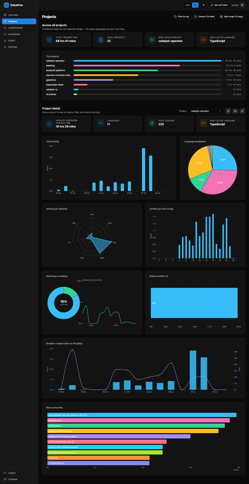
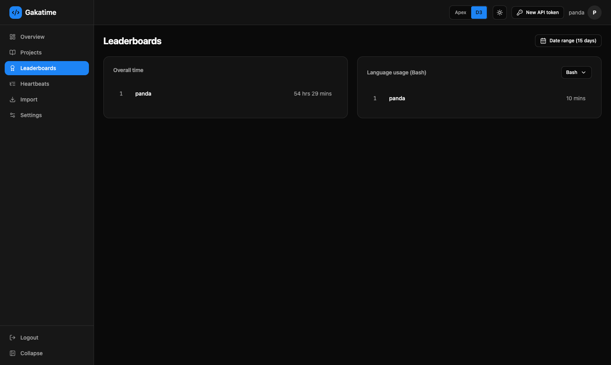
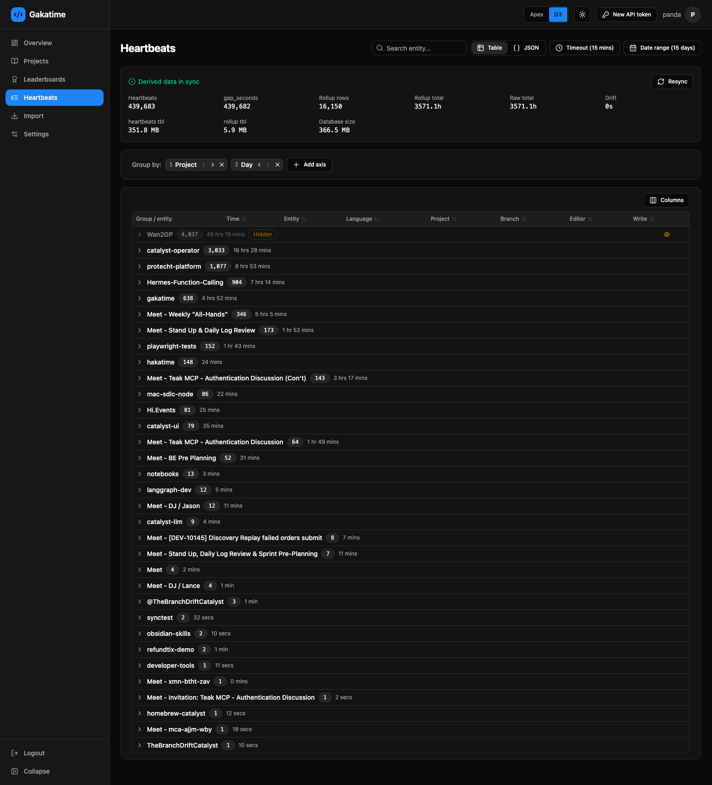
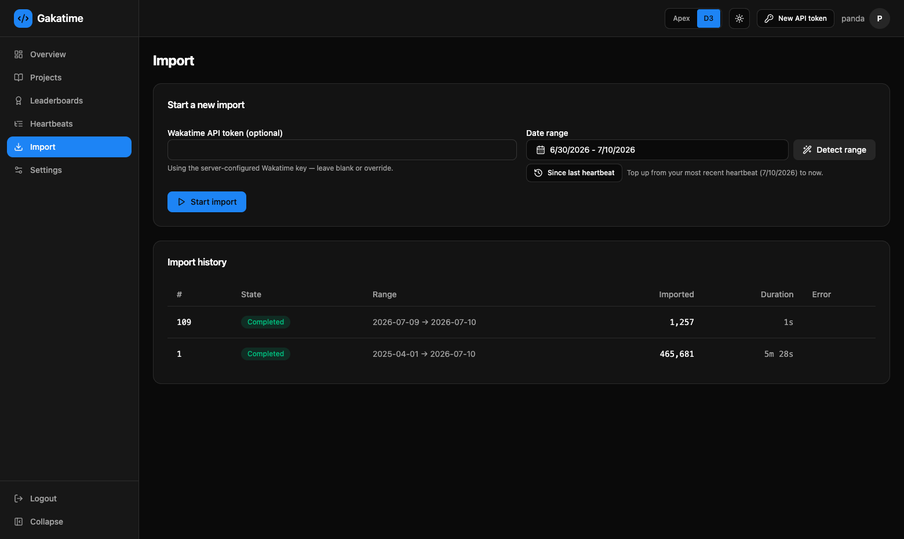
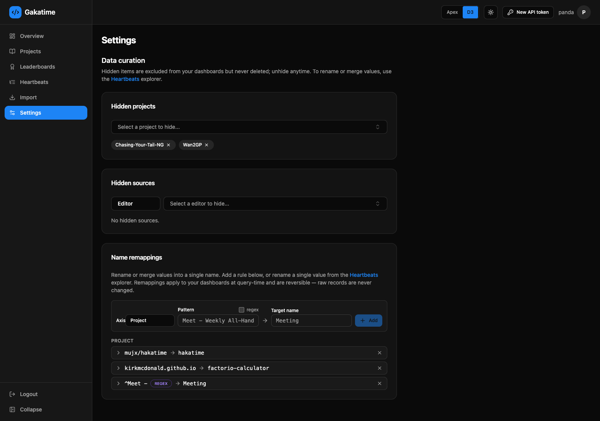
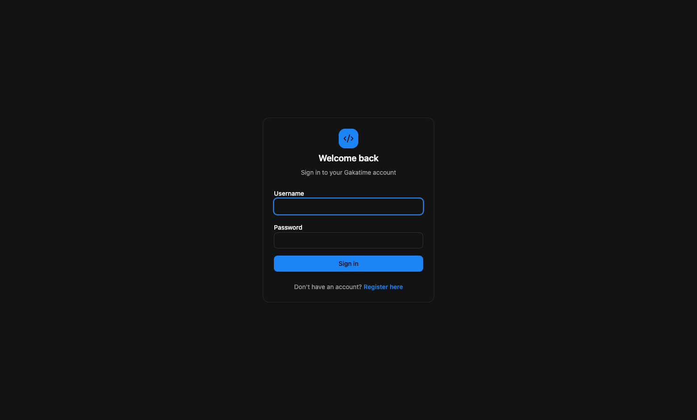

# gakatime — Live Demo Tour 🔥

A page-by-page walkthrough of a **real, heavily-used instance** — one developer's entire
coding history, self-hosted off wakatime.com.

## The dump being visualized

| | |
|---|---:|
| 🫀 Heartbeats | **439,683** |
| 📦 Projects | **691** |
| 🔤 Languages | **68** |
| ⏱️ Tracked time | **3,571 hrs** (~149 days) |
| 📅 History | **465 days** (since Apr 2025) |
| 💻 Editors · Machines | **41 · 9** |
| 🧭 Top categories | Browsing **2,120h** · Coding **865h** · AI-Coding **360h** · Meeting **95h** |

Every screenshot below is that dataset, **full-page**, in the default dark theme.
The top bar on every page: **Apex ↔ D3** renderer toggle · theme toggle · New API token ·
user menu. The left rail collapses to icons (persisted).

---

## 🏠 Overview — `/app`
The whole coding life on one screen, for any date range (**"All time"** stays fast via ~weekly bucketing).

- **Stat cards** — Total tracked time · Total projects · Most-active project · Most-active language.
- **Category breakdown** — time + % per activity type (Browsing, Coding, AI-Coding, Meeting, Writing Docs…) so **non-code work is first-class**, not buried.
- **Streak & consistency** — current streak (excludes today's partial), longest streak, active-days %, 30-day sparkline.
- **Contribution calendar** — GitHub-style year-of-days heatmap (D3), quantized by intensity.
- **Total activity** column · **Project breakdown** pie · **Cumulative** coding time · **Category streamgraph** (what-kind-of-work over time).
- **Heatmaps** — activity per project & per language, value-shaded per cell.
- **Patterns** — **Coding punchcard** (day × hour) · **Project momentum** grid (project × week heat) · **Deep-work sessions** (count / avg / longest + length histogram + over-time).
- **Recent timeline** — the last N hours by language.

---

## 📦 Projects — `/app/projects`
An **aggregate rail** on top (so a young project's total never masquerades as your grand total), then explicit per-project detail.

- **Across all projects** — the aggregate (total tracked time, project count, most-active project/language) + a **Top projects** bar (click a bar to jump to it).
- **Project detail** — a prominent **project selector**, then: Total activity · Language pie · **Weekday radar** · Hour-of-day · **Authoring vs Reading** donut · **Branch activity** · **Breadth vs depth** (time vs distinct files/day) · **Most active files** (real files only, browsing domains excluded).
- **Per-project actions** — GitHub commit report · tags · shields.io badge.

---

## 🏆 Leaderboards — `/app/leaderboards`

- **Global** leaderboard — top senders by tracked time (>60s filter, top-N).
- **Per-language** leaderboards — the same, split by language.
- Curation-aware for your own rows (hidden/remapped values respected).

---

## 🔎 Heartbeats Explorer — `/app/heartbeats`
The raw **audit** surface — group your firehose however you want, and **curate in place**.

- **Group by any axis** (project, language, editor, plugin, machine, platform, branch, category, day, type, entity, is-write, user-agent) with **multi-level** chips.
- **Unified TanStack table** — every group row shows **count + attributed time**; expand to lazily drill the next axis down to **leaf heartbeat rows** (sortable + column visibility). Per-leaf **JSON drawer**; **Table / JSON** toggle.
- **Curate inline** — per-row **Suppress** (reversible hide → `Hidden` badge) and **Rename / remap** (→ badge). The audit always shows the **raw** value even when dashboards merge it.
- **Derived-data health** — gap_seconds/rollup status, drift, table + DB sizes, and a **Resync** button.

---

## ⬇️ Import — `/app/import`
First-class, **durable & resumable** migration off wakatime.com.

- **Start a job** over a date range · **"Since last heartbeat"** backfill · **Detect range** · optional per-run token (falls back to the server key).
- **Live logs** stream over a WebSocket with a progress bar; **cancel** mid-run; auto-**reconnect**.
- **Resilient** — reloading **re-binds** to the running job and resumes where it left off. **Idempotent** — re-imports never duplicate.
- **History** of past runs with logs, counts, and outcome.

---

## ⚙️ Settings — `/app/settings`
Data curation — all **reversible**, applied at **query-time**, raw records never touched.

- **Hidden projects / sources** — autocomplete comboboxes of your real values; kill noise on every dashboard while keeping it in the audit.
- **Name remappings** — a rule = **axis + pattern (exact or `regex`) + target**; **merge** many values into one (e.g. `^Meet - → Meeting`). Each rule is **clickable to see the affected raw values**. Remove to instantly revert.

---

## 🔐 Login / Register — `/login`

- Username + password **login**; **registration** (server-toggleable).
- Sessions ride an HttpOnly refresh-token cookie; the access token stays in memory.

---

← back to the [README](README.md) · schema: [docs/db-erd.mmd](docs/db-erd.mmd) · testing: [docs/testing/TEST_MATRIX.md](docs/testing/TEST_MATRIX.md)
