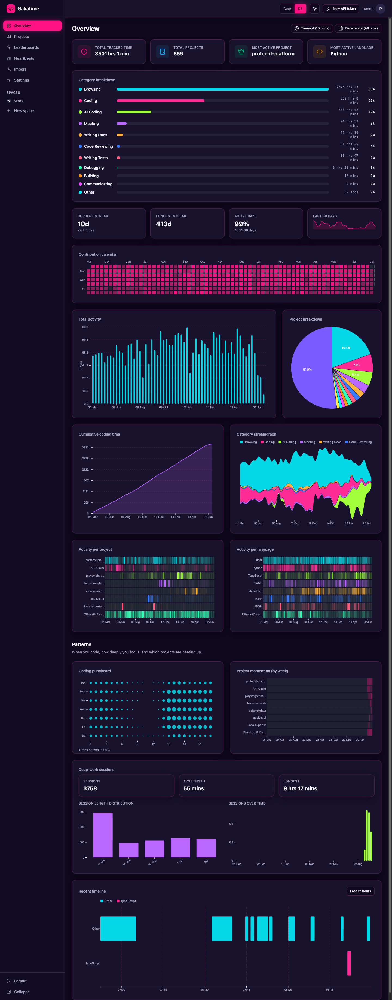

<h1 align="center">boomtime</h1>

<p align="center">
  <b>Self-hosted, Wakatime-compatible coding-time tracker.</b><br>
  Go + Echo + Postgres backend · React + Vite + Tailwind frontend · single embedded binary.<br>
  Point your editor plugins at it, import your history off wakatime.com, and stop paying a subscription — <b>without losing Wakatime compatibility.</b>
</p>

<p align="center"><i>A real instance: 439,683 heartbeats · 691 projects · 68 languages · 3,571 hrs over 465 days.</i></p>

<p align="center"><a href="DEMO.md"></a></p>

<p align="center"><a href="DEMO.md"><b>→ Full visual tour of every page (DEMO.md)</b></a></p>

---

## What it is


boomtime is a from-scratch reimplementation of [hakatime](https://github.com/mujx/hakatime)
in Go + React. The **HTTP API is wire-compatible with Wakatime** (paths, JSON field names,
`Authorization: Basic <token>`), so existing editor plugins keep working unchanged — just
set `api_url` in `~/.wakatime.cfg`. Bring your data over with the first-class **/import**,
then decommission wakatime.com.

## Highlights

- **Wakatime-compatible ingest** — heartbeats (single + bulk), user-agent/language detection, optional remote-write forwarding.
- **Durable, resumable import** from wakatime.com — live-log WebSocket, cancel, reload-safe re-bind, idempotent.
- **Fast analytics at any range** — attributed duration is precomputed per heartbeat (`gap_seconds`) and a daily rollup table backs the default path, so **"All time" over ~440k rows is instant** (windowless conditional sums, no per-request scans).
- **10 D3 visualizations** — contribution calendar, streak banner, cumulative, category streamgraph, punchcard, momentum grid, deep-work sessions, authoring-vs-reading, branch activity, breadth-vs-depth — plus the classic column/pie/heatmap/radar/timeline.
- **Apex ↔ D3 renderer toggle** (strangler-fig) — every chart has both implementations behind one switch.
- **Heartbeats Explorer** — a unified TanStack table that groups your firehose by *any* axis (multi-level), drills lazily to raw rows + JSON, and lets you **curate in place**.
- **Reversible, query-time curation** — hide noisy projects/sources, and rename/**merge** values (exact **or `regex`**, e.g. `^Meet - → Meeting`) — all applied at read time, raw records never mutated, undo anytime.
- **Spaces** — named, rule-based scopes (any axis, exact/`regex`) that each become a sidebar tab + a full dashboard filtered to their members (e.g. `project ~ ^catalyst` → just your work). One scope concept; replaces tags.
- **Modern dark-first UI**, collapsible sidebar, derived-data health panel with DB sizes + one-click resync.

See it all in the **[visual tour → DEMO.md](DEMO.md)**.

## Quickstart

```bash
# 1. bring up the whole dev stack (Postgres + Go/air + Vite) — migrations run at startup
docker compose up            # app on :8080, dashboard proxied on :5173
#   …or host-native:  task db:up && task dev

# 2. create a user + API token
task create-user  -- -u you
task create-token -- -u you        # prints a UUID token

# 3. point your editor at boomtime  (~/.wakatime.cfg)
#    api_url = http://localhost:8080/api/v1/users/current/heartbeats.bulk
#    api_key = <the UUID token>

# 4. import your history: open the Import page, paste your wakatime.com key, pick a range
```

Single-binary prod build: `task build` embeds the SPA (`go:embed web/dist`) into one Go binary; a multi-stage `Dockerfile` is included.

## Architecture (one screen)

- **Backend** — Go 1.25, **Echo v5**, **pgx** + pgxpool, **goose** migrations (embedded, auto-run), Argon2id auth, cobra CLI, `log/slog`. The 11 stat `.sql` files are embedded; heavy aggregation stays in Postgres.
- **Perf model** — `gap_seconds` (seconds to the previous heartbeat per sender in global time order) is computed at ingest; "time spent" = `SUM(gap_seconds ≤ timeLimit)`. A coarse `hb_rollup_daily` table backs the default 15-min path; non-default falls back to raw. Top-N + "Other" and ~weekly bucketing keep payloads bounded.
- **Curation** — `hide`/`rename` rules live in `curation_rules` and are applied **at query time** (exclusion / `CASE`-remap threaded through every aggregation), so they're reversible and the Explorer audit stays raw.
- **Frontend** — React 19, Vite 8, Tailwind v4, TanStack Query + Table, react-router v7, D3 v7 + ApexCharts behind a renderer switch, shadcn/Radix.

## Documentation (progressive)

Start high-level and drill down:

0. **[WHY.md](WHY.md)** — the origin story: why it exists, what it fixes about Wakatime, and how it was built (agentic engineering, ~5 hours).
1. **[DEMO.md](DEMO.md)** — the visual tour: a full-page screenshot + feature list for every page.
2. **[docs/ARCHITECTURE.md](docs/ARCHITECTURE.md)** — how it fits together: request flow, the duration/rollup model, curation, layout.
3. **[docs/testing/TEST_MATRIX.md](docs/testing/TEST_MATRIX.md)** — the 2-layer test pyramid (backend unit + handler HTTP, frontend Vitest, e2e) and coverage matrices.
4. **[docs/db-erd.mmd](docs/db-erd.mmd)** — the database ERD (Mermaid). Regenerate with `task db:mermaid`.

## Development

```bash
task dev            # air (Go live-reload) + Vite HMR
task test           # go test ./... against an isolated boomtime_test DB (TestMain migrates it)
task db:mermaid     # regenerate docs/db-erd.mmd from the live schema (mermerd)
task build          # web build + single embedded Go binary
```

Common targets: `db:up` / `db:down` / `db:reset` / `db:psql`, `migrate`, `create-user`, `create-token`, `fixtures:gen`, `fmt`, `lint`, `tidy`.

---

<p align="center"><sub>Not affiliated with Wakatime — just wire-compatible with it.</sub></p>
