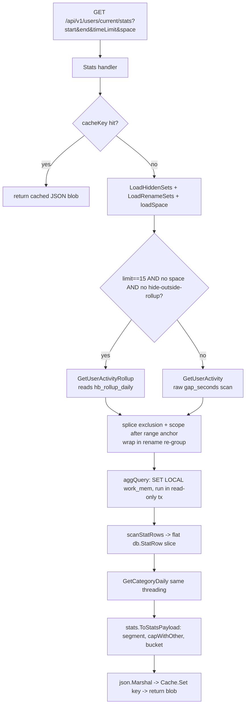

# The Query Engine

> How gakatime turns ~440k raw heartbeats into the numbers on a dashboard.

This is a deep dive for a new contributor who needs to touch stats aggregation,
curation (hide/rename), Space scoping, or the response cache. It documents the
**query engine**: the code path from an HTTP request for a dashboard down to the
SQL that runs against Postgres, and back up through the shaping and caching
layers.

For the one-paragraph version see [ARCHITECTURE.md](ARCHITECTURE.md#the-duration--rollup-model-why-its-fast).
This doc is the long version.

Everything here lives in three packages:

| Package | Role |
|---|---|
| `internal/handler` | Thin HTTP handlers: parse request, load curation/scope, call `db.*`, cache the JSON. |
| `internal/db` | The engine proper: embedded `.sql`, the ~11 aggregation functions, the curation/scope splicing layer. |
| `internal/stats` | Shaping: turn flat DB rows into the hakatime-compatible JSON payload, bound the payload size. |

There is **no ORM and no query builder**. Queries are hand-written SQL files
embedded at build time; curation and scope are added by *string-splicing bound-
parameter predicates* into those files at well-known anchor points. Read that
sentence again — it is the whole trick, and the rest of this doc explains why it
is safe and how to extend it.

---

## 1. The duration model: `gap_seconds`

Wakatime-style "time spent" is **not stored**. There is no `duration` column.
Time is derived from the gaps between consecutive heartbeats for a sender.

### 1.1 Computed once, at ingest

Migration `00008_heartbeat_gap_seconds.sql` adds the column and backfills it:

```sql
ALTER TABLE heartbeats ADD COLUMN IF NOT EXISTS gap_seconds INT;
-- Backfill existing rows (NULL for each sender's first heartbeat).
WITH seq AS (
    SELECT id,
        EXTRACT(EPOCH FROM (time_sent - lag(time_sent)
            OVER (PARTITION BY sender ORDER BY time_sent)))::int AS gap
    FROM heartbeats
)
UPDATE heartbeats h SET gap_seconds = seq.gap FROM seq WHERE h.id = seq.id;
```

`gap_seconds` is "seconds to the previous heartbeat for the same sender, in global
time order". It is `NULL` for each sender's very first heartbeat.

On every ingest batch, `SaveHeartbeats` (`internal/db/sessions.go`) recomputes it
incrementally for the affected senders via `RecomputeGaps`, which anchors on the
row **immediately before** the earliest inserted timestamp so out-of-order
inserts fix up the following row too:

```go
// RecomputeGaps ... anchors on the row immediately before `since` so the first
// affected row — and any existing beat that now follows a freshly inserted one —
// is correct.
func (d *DB) RecomputeGaps(ctx context.Context, sender string, since time.Time) error {
	_, err := d.Pool.Exec(ctx, `
WITH anchor AS (
    SELECT COALESCE(max(time_sent), '-infinity'::timestamptz) AS t
    FROM heartbeats WHERE sender = $1 AND time_sent < $2
),
seq AS (
    SELECT h.id, h.time_sent,
        lag(h.time_sent) OVER (ORDER BY h.time_sent) AS prev
    FROM heartbeats h, anchor
    WHERE h.sender = $1 AND h.time_sent >= anchor.t
)
UPDATE heartbeats h
SET gap_seconds = CASE
        WHEN seq.prev IS NULL THEN NULL
        ELSE EXTRACT(EPOCH FROM (seq.time_sent - seq.prev))::int
    END
FROM seq
WHERE h.id = seq.id AND h.time_sent >= $2`, sender, since)
	return err
}
```

### 1.2 "Time spent" = windowless conditional SUM

Because the gap is materialized, computing time for a range is a plain aggregate
— **no per-request `lag()` window, no sort, no session reconstruction**. Every
aggregation shares this shape (here `$4` is `timeLimit` in minutes; a gap larger
than the limit is treated as idle and contributes zero):

```sql
CAST(sum(CASE WHEN gap_seconds <= ($4 * 60) THEN gap_seconds ELSE 0 END) AS int8)
    AS total_seconds
```

This is the core of `get_user_activity.sql`, `get_category_daily.sql`,
`get_punchcard.sql`, `get_momentum.sql`, `get_projects_stats.sql`, and (with a
hardcoded 15-minute limit) `get_leaderboards.sql` / `get_time_today.sql`.

`get_sessions.sql` uses the same signal differently: a **new session starts** when
`gap_seconds IS NULL OR gap_seconds > ($4 * 60)` (the "break"), and a session's
duration is the SUM of its non-break gaps.

Since `gap_seconds` is per-sender by construction, `get_leaderboards.sql` gets
cross-user correctness for free — an earlier cross-user `lag()` bug simply cannot
recur (see the comment in that file).

---

## 2. The rollup fast-path: `hb_rollup_daily`

Scanning ~440k raw rows for the Overview on every load is wasteful when the
answer rarely changes. Migration `00009_hb_rollup_daily.sql` adds a coarse daily
rollup:

```sql
CREATE TABLE IF NOT EXISTS hb_rollup_daily (
    sender text NOT NULL,
    day date NOT NULL,
    project text NOT NULL,
    language text NOT NULL,
    editor text NOT NULL,
    platform text NOT NULL,
    machine text NOT NULL,
    total_seconds bigint NOT NULL,
    PRIMARY KEY (sender, day, project, language, editor, platform, machine)
);
```

It stores **exactly five breakdown axes** — `project, language, editor, platform,
machine` — plus `day` and a pre-summed `total_seconds` at the default 15-minute
gap cutoff (`gap_seconds <= 900`). No `branch`, `entity`, `category`, `plugin`.
Low cardinality by design.

It is maintained incrementally: `RefreshRollup` (`internal/db/sessions.go`) is
called after every ingest batch and re-derives the touched days
(`DELETE ... WHERE day >= $2::date`, then re-`INSERT ... SELECT` from raw).

### 2.1 When the fast path is used (and when it falls back)

The decision lives in the `Stats` handler (`internal/handler/stats.go`):

```go
switch {
case limit == 15 && !spaceRequested && !hidden.HasHiddenOutside(db.RollupAxes):
	// Fast path: pre-aggregated rollup (default 15-min limit, no space).
	rows, err = h.DB.GetUserActivityRollup(ctx, owner, t0, t1, hidden, renames, members, false)
default:
	// Raw gap_seconds scan (non-default limit, a hide the rollup can't apply,
	// or a space scope).
	rows, err = h.DB.GetUserActivity(ctx, owner, t0, t1, limit, hidden, renames, members, spaceRequested)
}
```

The three fall-back-to-raw conditions:

| Condition | Why the rollup can't serve it |
|---|---|
| `limit != 15` | The rollup is pre-summed at a 900s cutoff; a different `timeLimit` needs a fresh conditional SUM over raw gaps. |
| `spaceRequested` | A Space rule may target an axis the rollup lacks (`branch`/`entity`/…), so scoped requests always use raw. See `HasMemberOutside`. |
| `hidden.HasHiddenOutside(db.RollupAxes)` | A hide on `plugin`/`branch`/`category` can't be applied — the rollup has no such column. |

`RollupAxes` and the gate helpers:

```go
// RollupAxes are the hide axes the pre-aggregated hb_rollup_daily table can exclude.
var RollupAxes = map[string]bool{
	"project": true, "language": true, "editor": true, "platform": true, "machine": true,
}
```

```go
// HasHiddenOutside reports whether any hidden axis is NOT in the provided available set.
func (h HiddenSets) HasHiddenOutside(available map[string]bool) bool {
	for axis, vals := range h.byAxis {
		if len(vals) > 0 && !available[axis] { return true }
	}
	return false
}
```

`MemberSets.HasMemberOutside` is the exact mirror for Space scopes. (It is defined
but note that the current handler gates the rollup on `!spaceRequested` outright —
any Space request already takes raw — so `HasMemberOutside` is the belt-and-braces
check available to future callers that might want a rollup-with-space path.)

**Renames need no rollup fallback.** A rename only *relabels* output columns; it
never removes rows. The rollup's output columns are exactly the five remappable
axes, so re-summing pre-aggregated rows by the remapped value merges correctly.

---

## 3. The curation + scoping layer

This is the heart of the engine. Three families of per-user rules are applied
**at query time only** — raw heartbeats, projects, and the rollup are never
mutated, so every rule is instantly reversible and audit surfaces (the Explorer)
keep showing raw values.

| Rule family | Table | Sets type | Effect on SQL |
|---|---|---|---|
| **Hide** | `curation_rules` (action=`hide`) | `HiddenSets` | `AND NOT (col = ANY($n))` — drop rows |
| **Rename / merge** | `curation_rules` (action=`rename`) | `RenameSets` | outer re-group, `GROUP BY CASE`-remapped display value |
| **Space scope** | `spaces` / `space_rules` | `MemberSets` | `AND ( arm OR arm … )` — keep only matching rows |

All three are defined in `internal/db/curation.go` (hide + rename) and
`internal/db/spaces.go` (scope).

### 3.1 Match types

A rule's `match_type` (curation) or a Space rule's is one of:

- **`exact`** — `MatchValue` is a literal; SQL uses `col = ANY($arr)`.
- **`regex`** — `MatchValue` is a Postgres regex; SQL uses `col ~ $pattern`.
- **`template`** (rename only) — `MatchValue` is a regex **and** `NewValue` is a
  `regexp_replace` template with capture-group backrefs. This is a *transform*,
  not a fixed target: `col ~ $pat THEN regexp_replace(col, $pat, $tmpl)`.

Template inputs are normalized and validated:

- `NormalizeTemplate` rewrites shell-style `$1` → Postgres `\1` (and `$$` → literal `$`).
- `ValidateRegex` compiles the pattern via `SELECT ''::text ~ $1` (no row scan).
- `ValidateTemplate` additionally counts the pattern's capture groups (using a
  self-matching `(?:(?:PATTERN)|)()` probe, real count = reported − 1) and rejects
  any backref `\N` that exceeds the group count — Postgres itself only raises
  "invalid reference number" when the pattern *matches*, so a naive empty-string
  probe would silently miss a bad `\9`.

### 3.2 The predicate builders

**Exclusion (hide)** — `exclusionPredicate` walks the hide axes in a deterministic
order and appends one `AND NOT (…)` per hidden axis that has a column in `cols`:

```go
func exclusionPredicate(hs HiddenSets, cols map[string]string, nextArg int, args []any) (string, []any, int) {
	var sql string
	for _, axis := range hiddenAxes { // deterministic order
		vals := hs.byAxis[axis]
		col := cols[axis]
		if len(vals) == 0 || col == "" {
			continue // axis has no hide, or this query's table lacks the column
		}
		sql += fmt.Sprintf(" AND NOT (%s = ANY($%d))", col, nextArg)
		args = append(args, vals)
		nextArg++
	}
	return sql, args, nextArg
}
```

**Inclusion (Space)** — `inclusionPredicate` is the *union mirror*: one `AND ( …
OR … )` where exact values become one `col = ANY($n)` arm and each regex becomes
a `col ~ $n` arm:

```go
sql := " AND ("
for i, arm := range arms {
	if i > 0 { sql += " OR " }
	sql += arm
}
sql += ")"
```

Space scope has a crucial edge case handled by `spaceScopePredicate`: a *rule-less
or column-less* Space must match **nothing**, not everything, so it emits
` AND FALSE`:

```go
func spaceScopePredicate(ms MemberSets, cols map[string]string, nextArg int, args []any, spaceRequested bool) (string, []any, int) {
	if !spaceRequested { return "", args, nextArg }        // unscoped: no predicate
	if !ms.AnyMember() { return " AND FALSE", args, nextArg } // empty space => empty dashboard
	pred, args, nextArg := inclusionPredicate(ms, cols, nextArg, args)
	if pred == "" { return " AND FALSE", args, nextArg }   // rules exist but not on this table's cols
	return pred, args, nextArg
}
```

### 3.3 The rename remap: `remapExpr` + `regroup…`

A rename can't just filter — it re-labels and merges, so the pct/daily_pct windows
must be recomputed over the *merged* groups. This is a two-step:

1. `remapExpr(axis, col, extraCond, nextArg, args)` builds a `CASE` expression
   mapping a raw column to its display value. WHEN order is **exact → regex →
   template** (first match wins), all values bound as params:

   ```
   CASE WHEN col = ANY($arr) THEN $t
        [WHEN col ~ $pat THEN $t2 ...]
        [WHEN col ~ $pat THEN regexp_replace(col, $pat, $tmpl) ...]
   ELSE col END
   ```

   The optional `extraCond` is ANDed into every WHEN — leaderboards use it
   (`sender = $req`) so a user's rename only relabels *their own* rows.

2. `regroupStatRows` / `regroupProjectStatRows` wrap the inner query in an outer
   `WITH regrouped AS ( SELECT <remapped cols>, SUM(total_seconds) … GROUP BY
   <remapped cols> )` and recompute the two percentage windows. `regroupStatRows`
   remaps six axes (`project, language, editor, branch, platform, machine`);
   `regroupProjectStatRows` remaps only `language` (the project-detail query is
   already project-scoped). Both are **no-ops when no rename applies**.

### 3.4 The `cols` maps: axis → SQL column

The predicate builders are injection-safe precisely because the axis→column
mapping never comes from user input — it comes from a hardcoded whitelist map, and
every value is a bound `$n` parameter. Which map you pass depends on the table the
query scans:

| Map | Used by | Notes |
|---|---|---|
| `rawHeartbeatCols` | every query whose innermost scan is `heartbeats` | all 8 hide axes available, unqualified columns |
| `rollupCols` | `GetUserActivityRollup` | only the 5 rollup axes |
| `projectListCols` | `GetAllProjects` | qualified `heartbeats.project`, … (a JOIN) |

If an axis isn't in the map you pass, its predicate is silently skipped — that is
how the rollup path drops a `branch` hide it can't express, and why the handler
must gate the fast path with `HasHiddenOutside` so it never *silently* ignores a
hide it was asked to apply.

### 3.5 The splice mechanism: `injectAfter` + range anchors

Predicates are inserted into the embedded SQL immediately after a **range-anchor**
constant — the query's range-end clause — using a literal string search:

```go
// injectAfter splices addition into query immediately after the first occurrence
// of anchor. If anchor is absent it returns query unchanged (so a drifted .sql is
// caught by the exclusion tests rather than producing broken SQL).
func injectAfter(query, anchor, addition string) string {
	if addition == "" { return query }
	idx := strings.Index(query, anchor)
	if idx < 0 { return query }
	pos := idx + len(anchor)
	return query[:pos] + addition + query[pos:]
}
```

Each aggregation defines its anchor as a Go constant that must appear verbatim in
its `.sql`:

| Anchor constant | `.sql` clause |
|---|---|
| `activityRangeAnchor` | `AND time_sent <= $3` |
| `rollupRangeAnchor` | `AND day <= $3::date` |
| `projectStatsRangeAnchor` | `AND time_sent <= $4` |
| `timelineRangeAnchor` | `AND time_sent < $3` |
| `leaderboardsRangeAnchor` | `AND time_sent <= $2` |
| `bigBetRangeAnchor` (category/punchcard/sessions/momentum) | `AND time_sent <= $3` |
| `timeTodayRangeAnchor` | `time_sent < (current_date + interval '1' day)` |

Keeping the anchor as a constant is a **safety valve**: if someone edits the
`.sql` and removes the anchor line, `injectAfter` returns the query unchanged, the
hide/scope predicate silently vanishes — and the curation integration tests catch
it (they assert hidden rows disappear).

---

## 4. The shared threading pattern

Almost every aggregation function follows the same recipe. Read it once and you
can read all eleven. Using `GetUserActivity` as the reference:

```go
func (d *DB) GetUserActivity(ctx, user, start, end, limit, hs HiddenSets, rs RenameSets, ms MemberSets, spaceRequested bool) ([]StatRow, error) {
	query := qGetUserActivity            // 1. the embedded .sql
	args := []any{user, start, end, limit}
	next := 5                            // first free positional param

	if hs.AnyHidden() {                  // 2. splice the hide exclusion after the anchor
		var pred string
		pred, args, next = exclusionPredicate(hs, rawHeartbeatCols, next, args)
		query = injectAfter(query, activityRangeAnchor, pred)
	}
	if spaceRequested {                  // 3. splice the space inclusion after the same anchor
		var pred string
		pred, args, next = spaceScopePredicate(ms, rawHeartbeatCols, next, args, spaceRequested)
		query = injectAfter(query, activityRangeAnchor, pred)
	}
	query, args = rs.regroupStatRows(query, next, args)  // 4. wrap in the rename re-group

	var out []StatRow                    // 5. run under elevated work_mem, scan rows
	err := d.aggQuery(ctx, query, args, func(rows pgx.Rows) (e error) {
		out, e = scanStatRows(rows); return
	})
	return out, err
}
```

The five beats, in order every time:

1. **Load the embedded `.sql`** (`qGet…`, embedded in `db.go` via `//go:embed`).
2. **Splice the hide predicate** after the range anchor (drop rows by raw value
   *before* aggregation).
3. **Splice the space predicate** after the same anchor (keep only in-scope rows).
4. **Wrap in the rename re-group** (merge + relabel + recompute % windows).
5. **Execute via `aggQuery`** — a read-only transaction that first runs
   `SET LOCAL work_mem = '256MB'` (tunable via `HAKA_STATS_WORK_MEM`) so the big
   sorts stay in RAM; the `SET LOCAL` is discarded by the read-only rollback, so
   it never leaks to another pooled connection.

**Ordering matters.** Hide and scope operate on *raw* values in the inner WHERE,
so they must be spliced before the rename re-group wraps the query — otherwise you
would be filtering on already-relabeled values. The code enforces this by
construction: splice first, wrap last.

Two functions deviate:

- **`GetLeaderboards`** is multi-user. Hide/rename/scope must apply to the
  **requester's own rows only** (one user's curation must not alter another user's
  leaderboard contribution). It reuses a single `$req` param, guards hide with
  `AND NOT (sender = $req AND col = ANY(...))`, scopes with
  `AND (sender <> $req OR <requester's inclusion>)`, and passes `extraCond =
  "sender = $req"` into `remapExpr`.
- **`GetActiveFiles`** builds its SQL inline (not from a `.sql` file) because it
  needs the remap applied *per raw row* before a `COUNT(DISTINCT remapped-project)`
  — so it interpolates `hidePred + spacePred` into a `WITH per_row` CTE rather than
  using `injectAfter`.

### 4.1 The aggregation functions

| Function | `.sql` file | `cols` map | Output row type |
|---|---|---|---|
| `GetUserActivity` | `get_user_activity.sql` | `rawHeartbeatCols` | `[]StatRow` |
| `GetUserActivityRollup` | `get_user_activity_rollup.sql` | `rollupCols` | `[]StatRow` |
| `GetProjectStats` | `get_projects_stats.sql` | `rawHeartbeatCols` | `[]ProjectStatRow` |
| `GetAllProjects` | *(inline SQL)* | `projectListCols` | `[]string` |
| `GetLeaderboards` | `get_leaderboards.sql` | `rawHeartbeatCols` (requester-scoped) | `[]LeaderboardRow` |
| `GetTimeline` | `get_timeline.sql` | `rawHeartbeatCols` (scope only) | `[]TimelineRow` |
| `GetCategoryDaily` | `get_category_daily.sql` | `rawHeartbeatCols` | `[]CategoryDailyRow` |
| `GetPunchcard` | `get_punchcard.sql` | `rawHeartbeatCols` (hide+scope; no rename) | `[]PunchcardCell` |
| `GetSessions` | `get_sessions.sql` | `rawHeartbeatCols` (hide+scope; no rename) | `[]SessionRow` |
| `GetMomentum` | `get_momentum.sql` | `rawHeartbeatCols` | `[]MomentumRow` |
| `GetActiveFiles` | *(inline SQL)* | `rawHeartbeatCols` | `[]ActiveFile` |

`GetTimeline`, `GetPunchcard`, `GetSessions` take no `RenameSets` — their output
columns (lang/project spans, dow×hour, session day) carry no renamable *breakdown*
axis, so a rename would have no output column to relabel. (The category/punchcard/
sessions/momentum trio shares the `applyBigBetHides` helper in `bigbets.go`.)

Row types live in `internal/db/rows.go` (`StatRow`, `ProjectStatRow`,
`TimelineRow`, `LeaderboardRow`) and next to their functions
(`CategoryDailyRow`, `PunchcardCell`, `SessionRow`, `MomentumRow` in `bigbets.go`;
`ActiveFile` in `active_files.go`).

---

## 5. Request → SQL flow



Concretely for `GET /stats` (`internal/handler/stats.go`):

```go
func (h *Handler) Stats(c *echo.Context) error {
	_, owner, aerr := h.resolveUser(c)          // token -> owner
	t0, t1 := defaultWeekRange(c)               // ?start/?end, default last 7d
	limit := timeLimit(c)                        // ?timeLimit minutes, default 15
	spaceParam := c.QueryParam("space")

	return h.cachedJSON(c, cacheKey(owner, "stats", t0, t1, limit, "space:"+spaceParam), func() (any, error) {
		hidden, _  := h.DB.LoadHiddenSets(ctx, owner)
		renames, _ := h.DB.LoadRenameSets(ctx, owner)
		members, spaceRequested, _ := h.loadSpace(ctx, spaceParam)
		// ... rollup-vs-raw switch (section 2.1) ...
		categories, _ := h.DB.GetCategoryDaily(ctx, owner, t0, t1, limit, hidden, renames, members, spaceRequested)
		return stats.ToStatsPayload(t0, t1, rows, categories), nil
	})
}
```

---

## 6. Worked example: a Space `project ~ ^catalyst` inclusion

Suppose a user has a Space with one rule `{axis: project, matchType: regex,
matchValue: ^catalyst}` and requests `GET /stats?space=7`.

`get_user_activity.sql`, inner CTE, **before** splicing:

```sql
    FROM
        heartbeats
    WHERE
        sender = $1
        AND time_sent >= $2
        AND time_sent <= $3        -- <-- activityRangeAnchor
    GROUP BY
        ...
```

`spaceRequested` is true; `spaceScopePredicate(ms, rawHeartbeatCols, 5, args, true)`
returns ` AND (project ~ $5)` and appends `^catalyst` as `args[4]`. `injectAfter`
splices it right after the anchor. **After**:

```sql
    WHERE
        sender = $1
        AND time_sent >= $2
        AND time_sent <= $3 AND (project ~ $5)   -- spliced inclusion
    GROUP BY
        ...
```

`args` is now `[user, start, end, 15, "^catalyst"]`. Only heartbeats whose raw
project matches `^catalyst` survive to the aggregate. If the same user *also* hid
project `catalyst-legacy`, the hide predicate splices first (lower `$n`), yielding
`… AND NOT (project = ANY($5)) AND (project ~ $6)` — hides and scope compose as a
plain AND of two independent predicates.

Contrast with a **rule-less** Space (`space=7` but zero rules):
`spaceScopePredicate` returns ` AND FALSE`, so the dashboard renders empty — the
deliberate "empty scope shows nothing, not everything" semantic.

---

## 7. Payload bounding

Two mechanisms keep the JSON small and the browser responsive on "All time" over
~440k rows:

**Top-N + "Other (N more)"** — `capWithOther` (`internal/stats/stats.go`) keeps
the `resourceTopN = 12` biggest resources per dimension and collapses the rest
into one aggregated bucket whose totals and per-day arrays are the element-wise
sums of the tail:

```go
const resourceTopN = 12

func capWithOther(list []model.ResourceStats) []model.ResourceStats {
	if len(list) <= resourceTopN { return list }
	sort.SliceStable(list, func(a, b int) bool { return list[a].TotalSeconds > list[b].TotalSeconds })
	top, tail := list[:resourceTopN], list[resourceTopN:]
	other := model.ResourceStats{Name: fmt.Sprintf("Other (%d more)", len(tail))}
	// ... element-wise sum tail into other ...
	return append(top, other)
}
```

Applied to projects, editors, languages, platforms, machines, categories, files,
branches. `ToMomentumPayload` does its own top-N (default 8) project ranking.

**~Weekly bucketing** — long daily time-series are downsampled to
`MAX_CHART_POINTS = 62` on the frontend (`web/src/viz/bucket.ts`). `bucketGroups`
is identity when `dayCount <= 62`, else it groups days into `ceil(dayCount/62)`-
sized contiguous buckets; `bucketSum`/`bucketAvg`/`bucketMax` reduce each bucket
per the metric's semantics:

```ts
export const MAX_CHART_POINTS = 62;
export function bucketGroups(dayCount: number): number[][] {
  if (dayCount <= MAX_CHART_POINTS) return Array.from({ length: dayCount }, (_, i) => [i]);
  const size = Math.ceil(dayCount / MAX_CHART_POINTS);
  // ... contiguous groups of `size` days ...
}
```

The contribution calendar is the intentional exception — it needs raw daily cells
(a year is ~465 cells, cheap).

---

## 8. The response cache

Aggregations are cached as marshaled JSON blobs in a tiny per-process TTL cache
(`internal/cache/ttl.go`), wired in the handler.

**Key** — `cacheKey(owner, name, parts...)` builds `"owner|name|part|part…"`
(`time.Time` parts render as Unix seconds):

```go
func cacheKey(owner, name string, parts ...any) string {
	// "owner|name|<unix t0>|<unix t1>|<limit>|space:<id>"
}
```

The range, `timeLimit`, and `?space` **all enter the key**, so a scoped or
non-default-limit request never collides with the unscoped default:

```go
cacheKey(owner, "stats", t0, t1, limit, "space:"+spaceParam)
```

**TTL** — `statsCacheTTL()` defaults to 30s (tunable via `HAKA_STATS_CACHE_TTL`
seconds; `0` disables). `cachedJSON` serves the cached blob on a hit, else computes
+ marshals + `Cache.Set`s.

**Invalidation** — the key is prefixed with `owner + "|"`, so changing a user's
curation or spaces drops *all* their cached dashboards at once:

```go
func (h *Handler) invalidateOwnerCache(owner string) {
	if h.Cache != nil {
		h.Cache.InvalidatePrefix(owner + "|")
	}
}
```

`invalidateOwnerCache` is called from every curation and space mutation handler
(`internal/handler/curation.go`, `internal/handler/spaces.go`). A change takes
effect immediately for that owner; other owners' entries survive (`InvalidatePrefix`
only drops matching keys). Beyond explicit busts, the 30s TTL bounds staleness for
everything else (e.g. a fresh ingest).

---

## 9. Extension guide

### 9.1 Add a new scoped aggregation

Say you want a new "top dependencies" dashboard endpoint.

1. **Write the `.sql`** in `internal/db/queries/`. Follow the shape of an
   existing file: an inner scan of `heartbeats` (or the rollup) that produces the
   windowless conditional SUM, with a range-end clause that will be your anchor.
   Make the range-end clause a **stable, unique** literal.
2. **Embed it** in `internal/db/db.go`: add a `qGetTopDeps = mustQuery("get_top_deps.sql")`
   line to the preloaded `var (...)` block. (The `//go:embed queries/*.sql`
   directive already includes any new file.)
3. **Add the anchor constant** next to your function:
   `const topDepsRangeAnchor = "AND time_sent <= $3"` (must match your `.sql` byte
   for byte).
4. **Write the row type** (in `rows.go` or beside the function) and a
   `scan…` helper.
5. **Write the function** following the section-4 threading recipe: build `args`,
   splice `exclusionPredicate(hs, rawHeartbeatCols, …)` and
   `spaceScopePredicate(ms, rawHeartbeatCols, …)` after your anchor via
   `injectAfter`, then — if any output column carries a renamable axis — write a
   `regroup…`-style wrapper (or reuse `regroupStatRows` if your columns match).
   Run it under `d.aggQuery`.
6. **Add the handler** (`internal/handler/…`): resolve owner, read range/limit/
   space, load `LoadHiddenSets` + `LoadRenameSets` + `loadSpace`, and wrap the
   call in `cachedJSON` with a `cacheKey` that includes range, limit, **and**
   `"space:"+spaceParam`.
7. **Add a curation/scope integration test** that asserts a hidden value
   disappears and a Space scope filters — this is what catches an anchor typo.

### 9.2 Add a new curation / scope axis

Say heartbeats gain a `repo` column you want to hide/rename/scope on.

1. **Whitelist the axis** in the relevant maps in `curation.go` /
   `sessions.go`: add `"repo": "repo"` to `rawHeartbeatCols`, and to
   `projectListCols` as `"repo": "heartbeats.repo"` if it should filter the
   projects list.
2. **Add it to `hiddenAxes`** (the deterministic ordered hide-axis list) so
   `exclusionPredicate`/`inclusionPredicate` iterate it.
3. **Make the axis pass `ExploreColumn`'s whitelist** so Space-rule and
   curation-rule creation accept it (`AddSpaceRule` and rule creation validate
   the axis against `ExploreColumn`).
4. **If it should be renamable/mergeable**, add `{"repo", "repo"}` to
   `statRowRemapAxes` and extend the relevant `regroup…` wrapper's SELECT/GROUP BY
   so the new axis is remapped and re-summed.
5. **Rollup?** If you want `repo` hides to survive the fast path, you'd have to add
   the column to `hb_rollup_daily` (new migration), `rollupCols`, and `RollupAxes`.
   Otherwise leave it out — `HasHiddenOutside` will correctly force the raw path
   whenever a `repo` hide is active.
6. **Tests**: extend the axis-coverage suites
   (`regex_all_aggregations_test.go`, `rename_merge_test.go`,
   `suppression_test.go`, `spaces_test.go`).

---

## 10. Gotchas

- **The rollup only stores 5 axes.** `hb_rollup_daily` has no `branch`, `entity`,
  `category`, or `plugin`. A hide/scope on those *must* force the raw path
  (`HasHiddenOutside` / `!spaceRequested`). If you add a rollup consumer, gate it
  the same way or you will silently ignore a hide the user asked for.

- **Template rename is transform, not match.** An `exact`/`regex` rename maps to a
  *fixed* `NewValue`; a `template` rename maps to `regexp_replace(col, $pat,
  $tmpl)` — the output is computed per row. `ValidateTemplate` guards bad
  backrefs, but remember `NormalizeTemplate` (`$1`→`\1`) runs first, so store the
  normalized form.

- **Anchor drift silently drops predicates.** `injectAfter` returns the query
  *unchanged* if the anchor literal isn't found. Edit a `.sql`'s range-end clause
  and you'll silently disable that query's hide/scope — only the integration tests
  catch it. Keep the anchor constant and the `.sql` clause byte-identical.

- **Cache invalidation only fires from the curation/space handlers.** Anything
  that mutates heartbeats or curation via *direct SQL* (a manual `UPDATE`, a
  migration, an admin script) bypasses `invalidateOwnerCache`, so cached
  dashboards can serve stale data for up to the TTL (30s default). The ingest path
  is not explicitly invalidated either — it relies on the TTL.

- **Never run these aggregations against a write connection with EXPLAIN
  ANALYZE.** `aggQuery` runs in a read-only transaction that it *rolls back*
  (that's how `SET LOCAL work_mem` is discarded). If you copy a query out to
  benchmark it, `EXPLAIN ANALYZE` **executes** it — harmless for these SELECTs,
  but the same care applies to the ingest-side `RecomputeGaps`/`RefreshRollup`
  `UPDATE`/`DELETE`+`INSERT`: `EXPLAIN ANALYZE` on those *performs the write*. Use
  plain `EXPLAIN` (no ANALYZE) on any write, or wrap in a `ROLLBACK`.

- **Percentages are recomputed on merge.** `pct`/`daily_pct` are `numeric(13,12)`
  window fractions. Any rename re-group *must* recompute them over the merged
  groups (the `regroup…` wrappers do). If you write a new merge path, don't carry
  the inner percentages up — re-derive them.

---

## Related code

- `internal/db/sessions.go` — gap model, rollup, `GetUserActivity(Rollup)`,
  `GetLeaderboards`, `GetAllProjects`, `injectAfter`, `aggQuery`.
- `internal/db/curation.go` — hide + rename: `HiddenSets`, `RenameSets`,
  `exclusionPredicate`, `remapExpr`, `regroupStatRows`, template validation.
- `internal/db/spaces.go` — `MemberSets`, `inclusionPredicate`,
  `spaceScopePredicate`.
- `internal/db/bigbets.go`, `active_files.go` — category/punchcard/sessions/
  momentum + cross-project active files.
- `internal/db/queries/*.sql` — the embedded SQL.
- `internal/db/migrations/00008*`, `00009*` — the gap column + rollup table.
- `internal/handler/stats.go`, `handler.go` — rollup-vs-raw decision, `cacheKey`,
  `cachedJSON`.
- `internal/stats/stats.go`, `bigbets.go` — shaping + `capWithOther`.
- `web/src/viz/bucket.ts` — frontend ~weekly bucketing.
