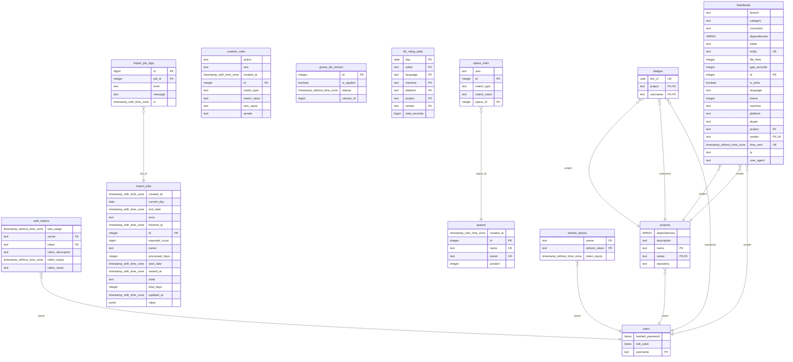

```mermaid
erDiagram
    auth_tokens {
        timestamp_without_time_zone last_usage 
        text owner FK 
        text token PK 
        text token_description 
        timestamp_without_time_zone token_expiry 
        text token_name 
    }

    badges {
        uuid link_id UK 
        text project PK,FK 
        text username PK,FK 
    }

    curation_rules {
        text action 
        text axis 
        timestamp_with_time_zone created_at 
        integer id PK 
        text match_type 
        text match_value 
        text new_value 
        text sender 
    }

    goose_db_version {
        integer id PK 
        boolean is_applied 
        timestamp_without_time_zone tstamp 
        bigint version_id 
    }

    hb_rollup_daily {
        date day PK 
        text editor PK 
        text language PK 
        text machine PK 
        text platform PK 
        text project PK 
        text sender PK 
        bigint total_seconds 
    }

    heartbeats {
        text branch 
        text category 
        text cursorpos 
        ARRAY dependencies 
        text editor 
        text entity UK 
        integer file_lines 
        integer gap_seconds 
        integer id PK 
        boolean is_write 
        text language 
        integer lineno 
        text machine 
        text platform 
        text plugin 
        text project FK 
        text sender FK,UK 
        timestamp_without_time_zone time_sent UK 
        text ty 
        text user_agent 
    }

    import_job_logs {
        bigint id PK 
        integer job_id FK 
        text level 
        text message 
        timestamp_with_time_zone ts 
    }

    import_jobs {
        timestamp_with_time_zone created_at 
        date current_day 
        timestamp_with_time_zone end_date 
        text error 
        timestamp_with_time_zone finished_at 
        integer id PK 
        bigint imported_count 
        text owner 
        integer processed_days 
        timestamp_with_time_zone start_date 
        timestamp_with_time_zone started_at 
        text state 
        integer total_days 
        timestamp_with_time_zone updated_at 
        jsonb value 
    }

    projects {
        ARRAY dependencies 
        text description 
        text name PK 
        text owner PK,FK 
        text repository 
    }

    refresh_tokens {
        text owner FK 
        text refresh_token PK 
        timestamp_without_time_zone token_expiry 
    }

    space_rules {
        text axis 
        integer id PK 
        text match_type 
        text match_value 
        integer space_id FK 
    }

    spaces {
        timestamp_with_time_zone created_at 
        integer id PK 
        text name UK 
        text owner UK 
        integer position 
    }

    users {
        bytea hashed_password 
        bytea salt_used 
        text username PK 
    }

    auth_tokens }o--|| users : "owner"
    badges }o--|| projects : "project"
    badges }o--|| projects : "username"
    badges }o--|| users : "username"
    heartbeats }o--|| projects : "project"
    heartbeats }o--|| projects : "sender"
    heartbeats }o--|| users : "sender"
    import_job_logs }o--|| import_jobs : "job_id"
    projects }o--|| users : "owner"
    refresh_tokens }o--|| users : "owner"
    space_rules }o--|| spaces : "space_id"
```