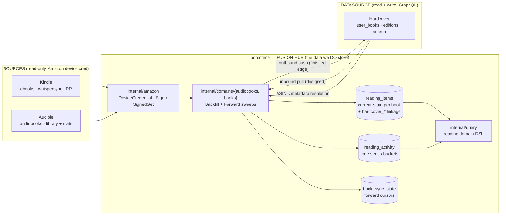
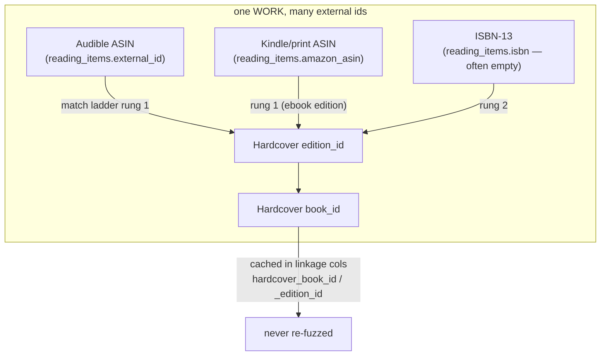
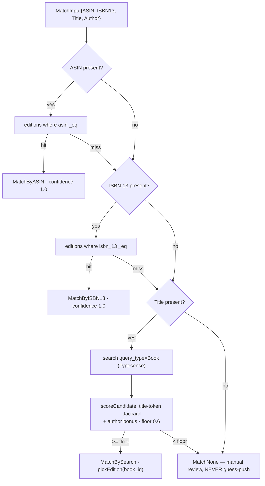
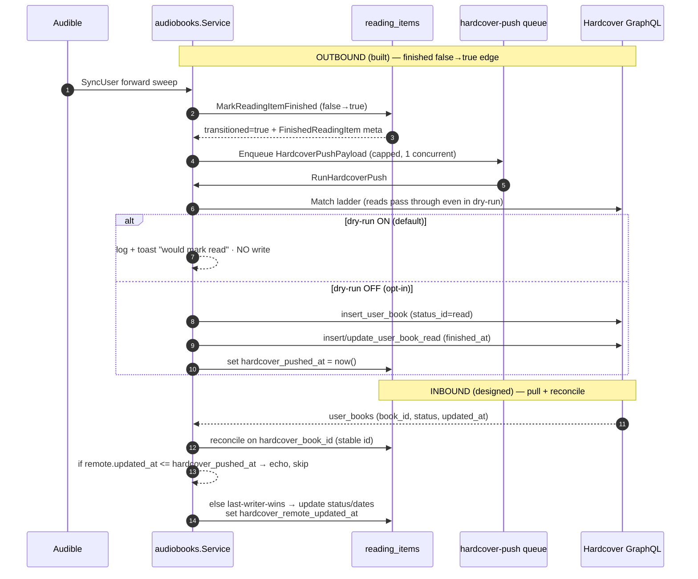
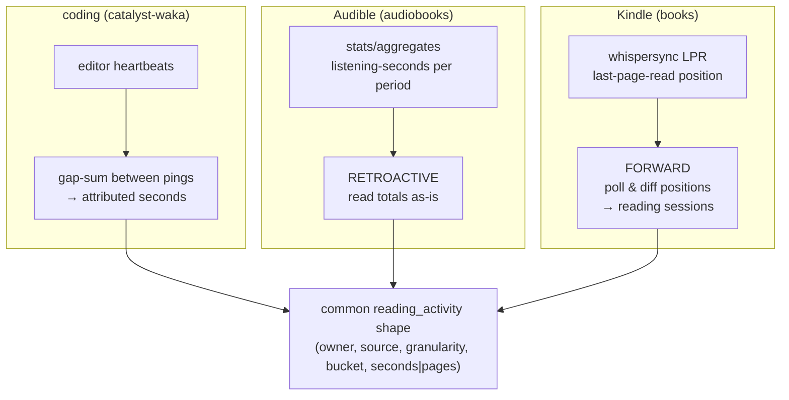
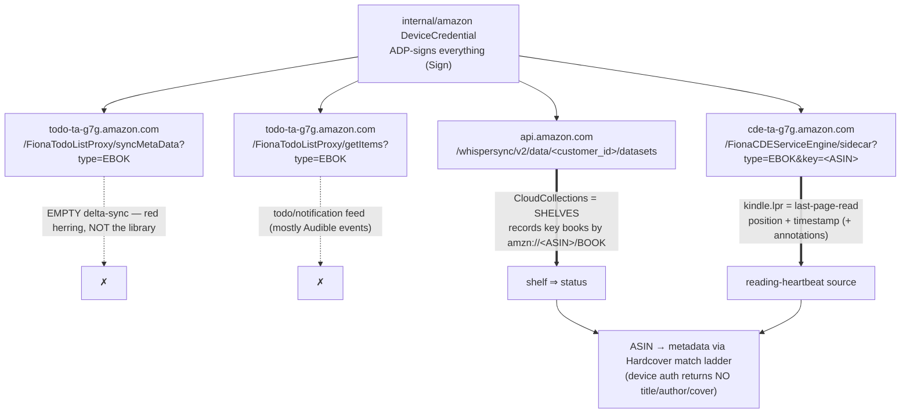
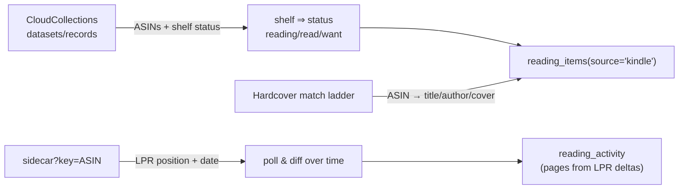

# catalyst-books Domain Architecture

> **Status:** architecture-of-record (2026-08). Higher-altitude companion to
> [`catalyst-books-sync-architecture.md`](./catalyst-books-sync-architecture.md).
> **Scope:** the reading/books *domain* — how boomtime bridges Kindle + Audible
> into a fused reading model, the **stable external identifiers** that make sync
> reconcilable, the **match engine**, **bidirectional sync** (outbound today,
> inbound designed), the **per-domain reading-heartbeat model**, and the
> reverse-engineered **Kindle API map** (documented here first — it is not yet in
> code).
> **Reading conventions.** Every symbol in `code font` (`reading_items`,
> `amazon.SignedGet`, `hardcover.Match`, `AudibleSyncKind`) is a real symbol on
> the current tree; file paths are cited inline so each claim is checkable.

**Relationship to the sync doc.** The companion doc is the *recipe*: the exact
Audible endpoints, response groups, paging, cursor bookkeeping, the notification
subsystem, and the phased implementation beads. **This** doc is the *domain +
identity + bidi + Kindle* layer above it. Where they touch (the match ladder, the
Hardcover push, `reading_activity`), this doc states the architecture and links
down; it does not re-derive the sync recipes. Read them together.

---

## 1. Overview — boomtime as the bridge

boomtime is not a book catalog. It is a **fusion hub** that sits between two
Amazon-owned *sources* it can only read, and one community *datasource*
(Hardcover) it can read **and** write. The design principle is: **store the
derived reading data and the groupable dimensions we need — never mirror
Hardcover's catalog.**

**What we store vs. what we resolve on demand:**

- **Store (derived + dimensional):** per-book current state (`reading_items`),
  the time-series of listening-seconds / pages (`reading_activity`), forward-sync
  cursors (`book_sync_state`), and the **groupable dimensions** the query DSL
  needs — `series`, `authors`, `genres` (flattened `category_ladders`), `status`,
  `source`. These are the things a dashboard groups/filters on and that no single
  source will re-serve cheaply.
- **Do NOT store (fetch on demand):** Hardcover's catalog. `00063_hardcover_link`
  is explicit — *"Hardcover is a bidirectional external DATASOURCE, not a thing we
  mirror. We persist only the MINIMAL linkage needed to reconcile ... No local
  shelf copy."* Book details beyond our own dimensions are fetched from Hardcover
  when needed via `internal/hardcover`.

The two ingestion domains own no auth and no push — those are shared plumbing
(`internal/amazon`, `internal/hardcover`), so a third source (print, Goodreads
import) or a second push target reuses the same seams.

---

## 2. Stable external identifiers — the reconciliation keys

Sync is only safe if every book is anchored to identifiers that are **stable
across sources and across runs**. A book, here, is *a set of external ids*; sync
reconciles on them and **never** re-fuzzes an id it has already resolved.

### 2.1 The keys, per source

| Key | Column(s) | Audible | Kindle | Print | Hardcover | Notes |
|---|---|---|---|---|---|---|
| **Amazon ASIN** | `reading_items.external_id` (uniqueness key), also `amazon_asin` | ✅ audio ASIN (the reliable id) | ✅ ebook ASIN | rarely | resolvable via `editions.asin` | The primary key everywhere Amazon touches. `UNIQUE (owner, source, external_id)` (`00058`). |
| **ISBN-13** | `reading_items.isbn` | ❌ **none** — audiobooks have no ISBN | sometimes | ✅ | `editions.isbn_13` | Audible has NO ISBN, so ASIN is the only reliable audio id. Kindle/print *may* carry one. |
| **Hardcover `book_id`** | `reading_items.hardcover_book_id` | resolved once | resolved once | resolved once | native | The work-level id; the diff basis for pull. |
| **Hardcover `edition_id`** | `reading_items.hardcover_edition_id` | resolved once | resolved once | resolved once | native | The format-specific edition (audio vs ebook vs physical). |

The `amazon_asin` column is the **cross-format join key**: an Audible edition and
its Kindle sibling can be recognized as the same work later because the library
item carries both the audio `asin` and the print/kindle `amazon_asin`
(`internal/domains/audiobooks/audiobooks.go` maps both onto the row).

### 2.2 Resolve-once, cache-forever

The Hardcover ids are resolved **once** by the match engine (§3) and cached in the
`00063_hardcover_link` columns — `hardcover_book_id`, `hardcover_edition_id`,
`hardcover_match_confidence`, `hardcover_matched_at`. A partial index
(`reading_items_hardcover_book_idx ... WHERE hardcover_book_id IS NOT NULL`) lets
the reconcile passes scan only already-linked rows. Re-matching happens only when
a row has no `hardcover_book_id`, or its confidence was `none`/`search` and new
identity fields appeared, or an operator forces it — this is what protects
Hardcover's < 60 req/min budget.

---

## 3. The match engine

One engine (`internal/hardcover/match.go`) powers **both** the outbound Hardcover
push **and** Kindle metadata resolution (§6). It walks a ladder from strongest to
weakest identity and **stops at the first confident hit**:

Grounding (`internal/hardcover/match.go`, `client.go`):

- **Rung 1 — ASIN** (`MatchByASIN`): `editionByField(ctx, "asin", asin)`. Covers
  BOTH the Audible audio ASIN and the Kindle/print `amazon_asin` — the caller
  passes whichever it has via `MatchInput.ASIN`. Exact-equality on
  `editions.asin`, confidence `1.0`.
- **Rung 2 — ISBN-13** (`MatchByISBN13`): `editionByField(ctx, "isbn_13", isbn)`,
  after `normalizeISBN` strips hyphens/spaces to bare digits.
- **Rung 3 — fuzzy search** (`MatchBySearch`): Hardcover's server-side
  `_like`/regex is disabled, so the only fuzzy path is the Typesense-backed
  `search(query, query_type:"Book")`. Candidates are scored **locally**
  (`scoreCandidate` — title-token Jaccard + a 0.15 author-match bonus) and only
  the best above a **0.6 floor** is accepted. `pickEdition(book_id)` then chooses
  an edition (a status-only push off `book_id` is still possible when a book lists
  no editions).
- **Rung 4 — no match** (`MatchNone`): IDs stay zero. The caller records it and
  **never guess-pushes** — a wrong push is worse than a miss. These surface in the
  admin manual-review list.

The `field` argument to `editionByField` is a compile-time constant from the
ladder (never user input), so the interpolated GraphQL is injection-safe by
construction. Every rung is at most one GraphQL call, and later rungs run only on
earlier misses — the ladder is throttle-friendly by design.

The resolved `MatchResult{BookID, EditionID, Method, Confidence}` is written to
the linkage columns and the format is chosen from the row's `source` via the
`reading_format_id` map (`FormatPhysical=1 · FormatAudio=2 · FormatEbook=4`,
`push.go`).

---

## 4. Bidirectional sync

Hardcover is a **read + write** datasource. Today the **outbound** half is built
and dry-run-gated; the **inbound** half is designed against the linkage columns
that already exist (`00063`) for exactly this purpose.

### 4.1 Outbound (built, dry-run-safe)

The forward sweep detects the **finished `false→true` edge**
(`MarkReadingItemFinished` in `internal/db/reading_items.go` returns
`(transitioned, meta, found)`), then `announceFinished` publishes a
`book.finished` notification and calls `mirrorFinishedToHardcover`. With an
`Enqueuer` wired the push is marshalled into a `HardcoverPushPayload` and routed
onto the `HardcoverPushKind` queue (capped at concurrency 1 — Hardcover's rate
limit is a *global* resource); otherwise it runs inline.

`RunHardcoverPush` (`audiobooks.go`) runs the match ladder, then:
- **Dry-run ON** (`client.DryRun()`): logs `hardcover DRYRUN: would push finished
  book` and publishes a `hardcover.dryrun` toast previewing exactly what *would*
  be written (bookId, editionId, status `read`, `finishedAt`) — then returns
  before any mutation.
- **Dry-run OFF:** `UpsertUserBook(bookID, editionID, StatusRead, FormatAudio)` →
  `UpsertRead(userBookID, {FinishedAt, EditionID, ReadingFormatID})`. On
  `ErrBadToken`, `hardcoverError` flips the stored key status to `invalid` so the
  UI prompts a re-paste.

Only the finish is mirrored outbound today; boomtime is the writer, so this is a
one-way overwrite of that field.

### 4.2 Inbound (designed) — the columns are already there

`00063_hardcover_link` provisions two provenance timestamps specifically for the
pull:

- **`hardcover_pushed_at`** — the last write *we* made out. **Echo-suppression:** a
  pulled `user_book` whose Hardcover `updated_at` is `<= hardcover_pushed_at` is
  our own write bouncing back — skip it.
- **`hardcover_remote_updated_at`** — Hardcover's `updated_at` at last sight. The
  **delta cursor** and the **last-writer-wins** basis: if the remote row is newer
  than both our push and our last-seen remote stamp, Hardcover wins and we update
  `reading_items` (status/dates) and advance `hardcover_remote_updated_at`.

Reconciliation keys on the **stable** `hardcover_book_id` (never a re-fuzz), so a
pulled shelf change lands on the right local row deterministically. The pull is
**dry-run-safe by the same gate** — it is a read (`user_books` query passes
through) plus a local write into our own siloed table; it never mutates
Hardcover. Building it is the main open item (§8): grab a real token, verify the
`user_books` shape, implement the pull + reconcile.

---

## 5. The reading-heartbeat model (per-domain translation)

boomtime's coding analytics are built on **heartbeats**: sparse editor pings whose
*gaps* are summed into duration. That model is native to coding and **does not
generalize** to reading. The architecture instead makes each domain responsible
for translating its **own** native signal into the common `reading_activity`
shape — one table, one grain (`owner, source, granularity, bucket_date,
listening_seconds, pages`), many translations.

| Domain | Native signal | Direction | Translation into `reading_activity` |
|---|---|---|---|
| **coding** | plugin heartbeats | forward | gap-summed between pings → attributed seconds (heartbeat model) |
| **Audible** | `stats/aggregates` listening-seconds per day/month | **retroactive** | Amazon already aggregated it; `sweepAggregates` reads the totals directly into `listening_seconds` buckets. No inference. |
| **Kindle** | whispersync **LPR** (last-page-read) polled over time | **forward** | poll-and-diff: successive LPR positions for an ASIN become reading sessions; the position delta over the interval is the "pages" signal (§6). No native duration exists — it is *reconstructed* from polling. |

This is why `reading_activity` carries **both** `listening_seconds` (audio) and a
nullable `pages` (ebook): the two domains produce structurally different signals
that the fusion layer overlays on one calendar. Audible fills buckets *backward*
from a stats endpoint that already knows the answer; Kindle must fill them
*forward* because Amazon exposes only the current position, never a history —
boomtime *becomes* the history by polling. The companion sync doc details the
Audible aggregates recipe (windows, granularity, cursor advance); the Kindle
forward model is specified in §6 below.

The query DSL (`internal/query/domains.go`) consumes this uniformly: the
`reading` domain exposes `seconds` → `sum(listening_seconds)` over
`reading_activity.bucket_date`, and `books`/`runtime` measures over
`reading_items.finished_at`, grouped by the `source · status · series · author ·
genre · title` dimensions. Canonical grouping keys (e.g. collapsing a series or an
author's variant spellings) ride the shared curation **pin** mechanism
(`internal/curation`, `CurationPin` action) — the same canonical-entity seam the
coding domain uses, not a books-specific one.

---

## 6. Kindle API map (reverse-engineered live, 2026-08)

> **This section is the primary record of the Kindle wire protocol** — it is not
> yet in code (`internal/domains/books` is a stub whose `SyncUser` returns nil).
> All of it is authenticated by the **shared** `internal/amazon` device
> credential: `amazon.Sign` ADP-signs every request (`x-adp-token` /
> `x-adp-alg: SHA256withRSA:1.0` / `x-adp-signature`), exactly as Audible does —
> **one Amazon registration authenticates both.** Hosts differ per call.

### 6.1 Endpoint map — what each surface actually is

| Host + path | What it *actually* is | Use |
|---|---|---|
| `todo-ta-g7g.amazon.com/FionaTodoListProxy/syncMetaData?type=EBOK` | An **empty delta-sync** feed. The initial red herring — it looks like it should be the library but returns nothing useful. | ✗ not the library |
| `todo-ta-g7g.amazon.com/FionaTodoListProxy/getItems?type=EBOK` | A **todo/notification feed** — mostly Audible events, not owned ebooks. | ✗ not the library |
| `api.amazon.com/whispersync/v2/data/<customer_id>/datasets` | **CloudCollections** = the user's **shelves** (Currently Reading / Done Reading / Have Not Read / series). Each `.../datasets/<id>/records` lists books by **ASIN** as keys of the form `amzn://<ASIN>/BOOK`. | ✅ **library + status.** Shelf ⇒ status: reading / read / want. `<customer_id>` is the numeric `DeviceCredential.CustomerID`, **not** the ASIN. |
| `cde-ta-g7g.amazon.com/FionaCDEServiceEngine/sidecar?type=EBOK&key=<ASIN>` | Per-book **`kindle.lpr`** — last-page-read (position + timestamp) plus annotations/bookmarks. | ✅ **the reading-heartbeat source** (§5). Poll over time; diff positions into sessions. |

### 6.2 No metadata over device auth

The device-signed endpoints return **no title/author/cover** — only ASINs, shelf
membership, and reading positions. So Kindle metadata is resolved the same way
everything else is: **ASIN → Hardcover** via the match ladder (§3, rung 1 on
`amazon_asin`). This is the second consumer of the one match engine.

> **Alternative (noted, not chosen):** the clean full-metadata library lives at
> `read.amazon.com` (the Cloud Reader), but it is **web-cookie** auth, not device
> auth — a different, more fragile session model. We deliberately resolve metadata
> through Hardcover instead of taking on a second Amazon auth surface.

### 6.3 Kindle ingest — Option A (chosen)

The chosen ingest pipeline, mapping onto the existing tables:

1. **CloudCollections → ASINs + shelf status.** Enumerate `datasets`, read each
   `records` set, extract the `amzn://<ASIN>/BOOK` keys, map shelf → `status`.
2. **sidecar → LPR position + date** for each ASIN. This is the polled signal.
3. **Hardcover → metadata.** Resolve each ASIN to title/author/cover through the
   match ladder (device auth has none).
4. **Write** `reading_items(source='kindle')` (state + resolved metadata + the
   `hardcover_*` linkage) and derive `reading_activity` rows from **polled LPR
   deltas** (the forward reading-heartbeat model, §5).

This slots straight into the existing domain shape: `books.Service` already holds
the shared `*amazon.Store` and the DB; only `SyncUser` (and a `BackfillUser`
mirror) need filling in, reusing `amazon.SignedGet`/`Sign`, `hardcover.Match`,
`UpsertReadingItem`, and `UpsertReadingActivity`.

---

## 7. Safety + gating

Every mechanism above is behind two independent, fail-safe gates and rides the
domain registry so secrets are never stranded.

- **Feature gate — `BOOM_FEATURE_BOOKS` (default false).** `cfg.BooksEnabled()`
  (`internal/config/config.go`) is the master switch for both domains + the shared
  Amazon connect flow. `main` ships with it off and stays deployable; all job
  registration and scheduling sits inside `if cfg.BooksEnabled()`
  (`cmd/boomtime/main.go`). `AudibleSyncEnabled()` folds in a positive
  `BOOM_AUDIBLE_SYNC_INTERVAL` (default `6h`).
- **Hardcover dry-run — `BOOM_HARDCOVER_DRYRUN` (default TRUE).** Fail-safe: with
  dry-run on, **no write ever reaches Hardcover.** `hardcover.Configure` sets the
  process-wide default at startup (`main.go` L112); the client's `graphql()`
  intercepts every `mutation`, logs `hardcover DRYRUN: write blocked`, and returns
  a simulated success so the push chain becomes a logged no-op (reads pass
  through). `RunHardcoverPush` *additionally* surfaces a per-book `hardcover.dryrun`
  toast before it would mutate — the user sees exactly what would be written. Two
  layers, both defaulting closed.
- **Concurrency caps.** `hardcover-push` is capped at concurrency **1**
  (`jobReg.SetConcurrency(audiobooks.HardcoverPushKind, 1)`) because Hardcover's
  < 60 req/min is a **global** resource shared across all users; the
  `KindLimiter` (`internal/jobs/limiter.go`, Redis- or mem-backed) enforces the
  fleet-wide cap. `audiobooks-audible-sync` and `-backfill` are likewise capped at
  1.
- **Domain registry drives rotate + backup.** The Amazon device credential and
  the Hardcover token are per-user AES-256-GCM secrets registered in
  `internal/domains/registry.go` (`encryptedColumns` + `backupColumns`). This is
  what makes the rotate-encryption-key command re-encrypt them and the whole-DB
  backup include their ciphertext + status columns **automatically** — the whole
  point of the registry is that a new domain adds one entry instead of being
  silently stranded on the next rotation or dropped from backups.
- **Siloed data.** `reading_items` / `reading_activity` / `book_sync_state` are
  all `ON DELETE CASCADE` with the user and never write into `heartbeats`/`stats`;
  the fusion layer *reads* them. Plaintext secrets are never logged and never
  returned by any API.

---

## 8. Open / next

- **Inbound Hardcover pull.** Grab a real Hardcover token, verify the live
  `user_books` shape, and build the pull → reconcile on `hardcover_book_id` →
  echo-suppress via `hardcover_pushed_at` → last-writer-wins via
  `hardcover_remote_updated_at` (§4.2). Columns exist; the query + reconcile loop
  do not yet.
- **Kindle ingest job.** Implement `books.Service.SyncUser`/`BackfillUser` against
  the §6 map (CloudCollections → sidecar LPR → Hardcover metadata →
  `reading_items`/`reading_activity`), reusing the shared `amazon` + `hardcover`
  plumbing. Register `KindleSyncKind` + a schedule behind `BooksEnabled()`.
- **Outbound beyond finish.** Today only the finished edge is mirrored; extending
  the push to status/progress changes is a follow-up once the inbound
  last-writer-wins arbitration is in place (so the two directions don't fight).
- **Manual-review surface.** Wire the `MatchNone` rows into an admin diagnostics
  list so low-confidence books can be resolved by hand rather than guess-pushed.

---

### Appendix — file map

| Concern | Path |
|---|---|
| Shared Amazon auth + signing | `internal/amazon/{amazon,register,signing,client}.go` |
| Hardcover connector + dry-run gate | `internal/hardcover/{client,match,push,hardcover}.go` |
| Audible domain (full) | `internal/domains/audiobooks/audiobooks.go` |
| Kindle domain (stub) | `internal/domains/books/books.go` |
| Domain registry (rotate/backup) | `internal/domains/registry.go` |
| Data model migrations | `internal/db/migrations/000{58,59,60,61,62,63}_*.sql` |
| DAL | `internal/db/{reading_items,reading_activity,book_sync_state,hardcover_token,amazon_device}.go` |
| Query DSL (reading domain) | `internal/query/domains.go` |
| Jobs concurrency limiter | `internal/jobs/{jobs,limiter,local}.go` |
| Wiring + gates | `cmd/boomtime/main.go`, `internal/config/config.go` |
| Sync recipe companion | [`docs/design/catalyst-books-sync-architecture.md`](./catalyst-books-sync-architecture.md) |
