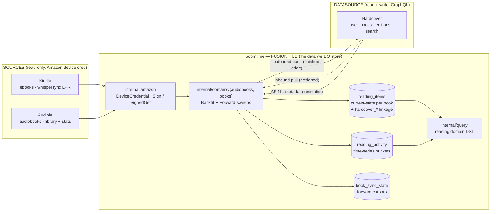
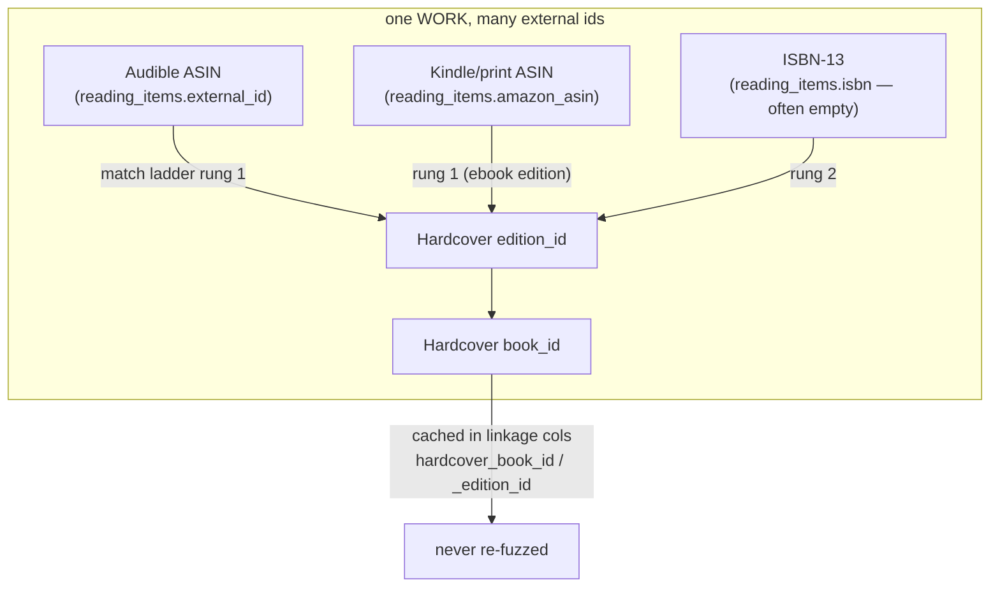
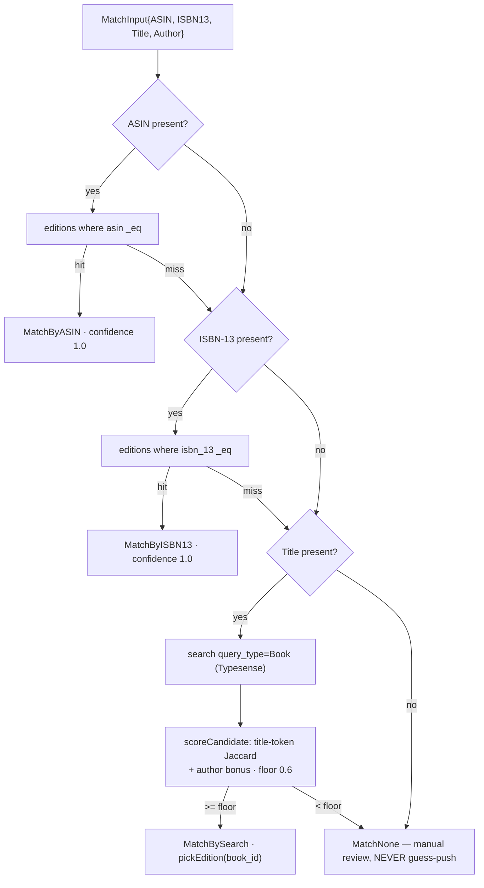
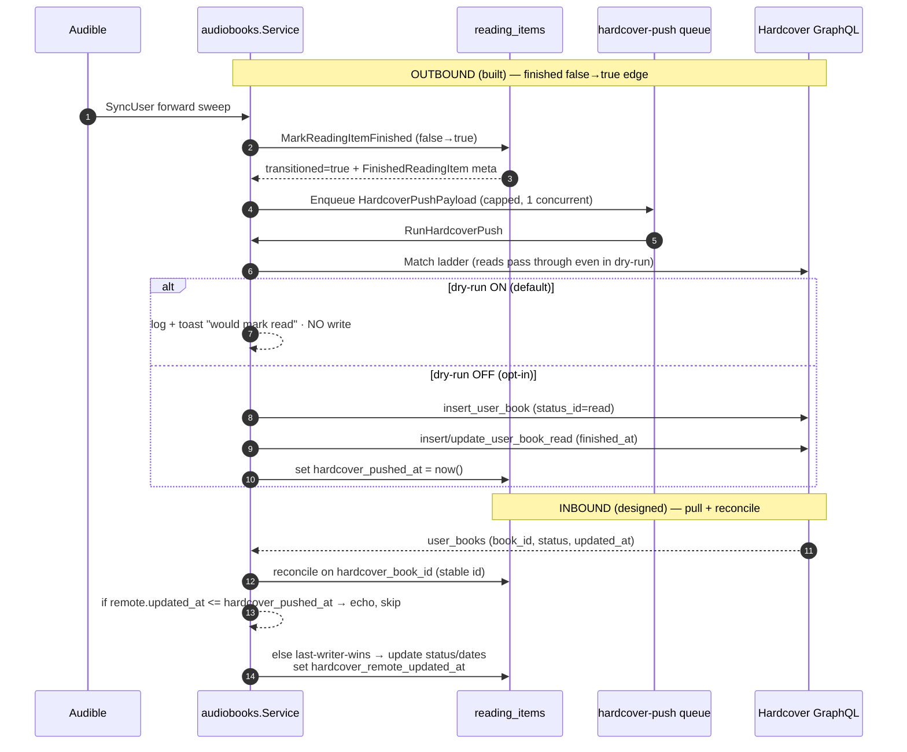
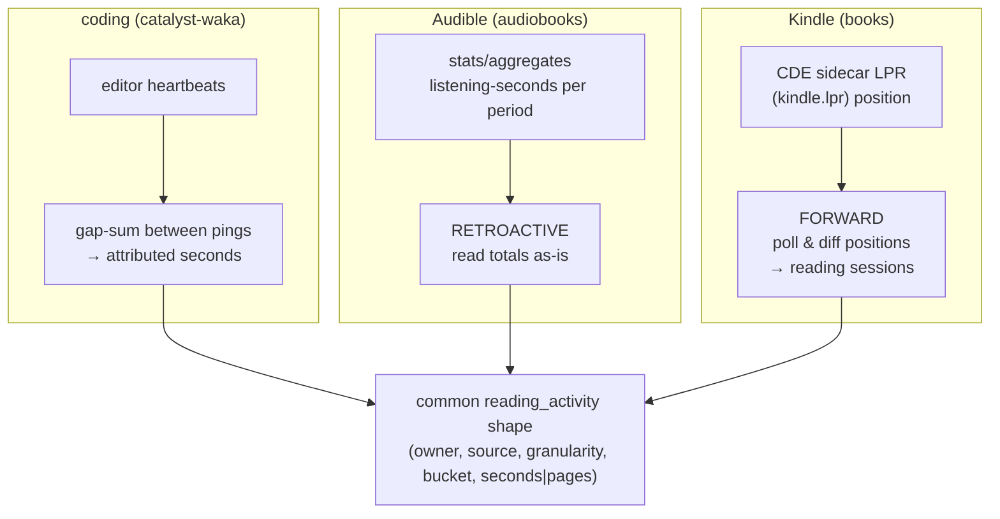
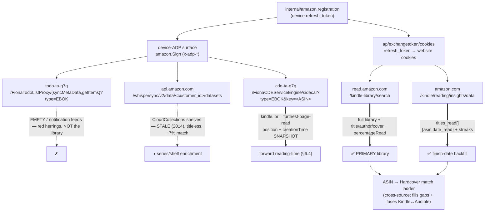
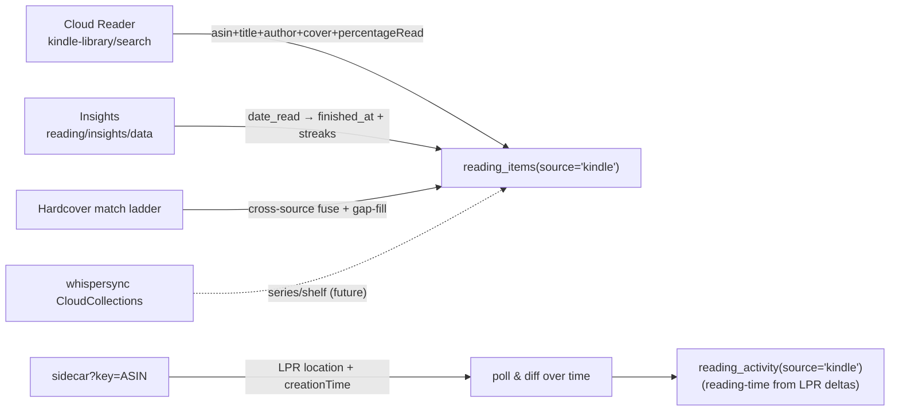

# catalyst-books Domain Architecture

> **Status:** architecture-of-record (2026-08). Higher-altitude companion to
> [`catalyst-books-sync-architecture.md`](./catalyst-books-sync-architecture.md).
> **Scope:** the reading/books *domain* — how boomtime bridges Kindle + Audible
> into a fused reading model, the **stable external identifiers** that make sync
> reconcilable, the **match engine**, **bidirectional sync** (outbound today,
> inbound designed), the **per-domain reading-heartbeat model**, and the
> reverse-engineered **Kindle API map** (documented here first — it is not yet in
> code).
> **Reading conventions.** Every symbol in `code font` (`reading_items`,
> `amazon.SignedGet`, `hardcover.Match`, `AudibleSyncKind`) is a real symbol on
> the current tree; file paths are cited inline so each claim is checkable.

**Relationship to the sync doc.** The companion doc is the *recipe*: the exact
Audible endpoints, response groups, paging, cursor bookkeeping, the notification
subsystem, and the phased implementation beads. **This** doc is the *domain +
identity + bidi + Kindle* layer above it. Where they touch (the match ladder, the
Hardcover push, `reading_activity`), this doc states the architecture and links
down; it does not re-derive the sync recipes. Read them together.

---

## 1. Overview — boomtime as the bridge

boomtime is not a book catalog. It is a **fusion hub** that sits between two
Amazon-owned *sources* it can only read, and one community *datasource*
(Hardcover) it can read **and** write. The design principle is: **store the
derived reading data and the groupable dimensions we need — never mirror
Hardcover's catalog.**



**What we store vs. what we resolve on demand:**

- **Store (derived + dimensional):** per-book current state (`reading_items`),
  the time-series of listening-seconds / pages (`reading_activity`), forward-sync
  cursors (`book_sync_state`), and the **groupable dimensions** the query DSL
  needs — `series`, `authors`, `genres` (flattened `category_ladders`), `status`,
  `source`. These are the things a dashboard groups/filters on and that no single
  source will re-serve cheaply.
- **Do NOT store (fetch on demand):** Hardcover's catalog. `00063_hardcover_link`
  is explicit — *"Hardcover is a bidirectional external DATASOURCE, not a thing we
  mirror. We persist only the MINIMAL linkage needed to reconcile ... No local
  shelf copy."* Book details beyond our own dimensions are fetched from Hardcover
  when needed via `internal/hardcover`.

The two ingestion domains own no auth and no push — those are shared plumbing
(`internal/amazon`, `internal/hardcover`), so a third source (print, Goodreads
import) or a second push target reuses the same seams.

---

## 2. Stable external identifiers — the reconciliation keys

Sync is only safe if every book is anchored to identifiers that are **stable
across sources and across runs**. A book, here, is *a set of external ids*; sync
reconciles on them and **never** re-fuzzes an id it has already resolved.



### 2.1 The keys, per source

| Key | Column(s) | Audible | Kindle | Print | Hardcover | Notes |
|---|---|---|---|---|---|---|
| **Amazon ASIN** | `reading_items.external_id` (uniqueness key), also `amazon_asin` | ✅ audio ASIN (the reliable id) | ✅ ebook ASIN | rarely | resolvable via `editions.asin` | The primary key everywhere Amazon touches. `UNIQUE (owner, source, external_id)` (`00058`). |
| **ISBN-13** | `reading_items.isbn` | ❌ **none** — audiobooks have no ISBN | sometimes | ✅ | `editions.isbn_13` | Audible has NO ISBN, so ASIN is the only reliable audio id. Kindle/print *may* carry one. |
| **Hardcover `book_id`** | `reading_items.hardcover_book_id` | resolved once | resolved once | resolved once | native | The work-level id; the diff basis for pull. |
| **Hardcover `edition_id`** | `reading_items.hardcover_edition_id` | resolved once | resolved once | resolved once | native | The format-specific edition (audio vs ebook vs physical). |

The `amazon_asin` column is the **cross-format join key**: an Audible edition and
its Kindle sibling can be recognized as the same work later because the library
item carries both the audio `asin` and the print/kindle `amazon_asin`
(`internal/domains/audiobooks/audiobooks.go` maps both onto the row).

### 2.2 Resolve-once, cache-forever

The Hardcover ids are resolved **once** by the match engine (§3) and cached in the
`00063_hardcover_link` columns — `hardcover_book_id`, `hardcover_edition_id`,
`hardcover_match_confidence`, `hardcover_matched_at`. A partial index
(`reading_items_hardcover_book_idx ... WHERE hardcover_book_id IS NOT NULL`) lets
the reconcile passes scan only already-linked rows. Re-matching happens only when
a row has no `hardcover_book_id`, or its confidence was `none`/`search` and new
identity fields appeared, or an operator forces it — this is what protects
Hardcover's < 60 req/min budget.

---

## 3. The match engine

One engine (`internal/hardcover/match.go`) powers **both** the outbound Hardcover
push **and** Kindle metadata resolution (§6). It walks a ladder from strongest to
weakest identity and **stops at the first confident hit**:



Grounding (`internal/hardcover/match.go`, `client.go`):

- **Rung 1 — ASIN** (`MatchByASIN`): `editionByField(ctx, "asin", asin)`. Covers
  BOTH the Audible audio ASIN and the Kindle/print `amazon_asin` — the caller
  passes whichever it has via `MatchInput.ASIN`. Exact-equality on
  `editions.asin`, confidence `1.0`.
- **Rung 2 — ISBN-13** (`MatchByISBN13`): `editionByField(ctx, "isbn_13", isbn)`,
  after `normalizeISBN` strips hyphens/spaces to bare digits.
- **Rung 3 — fuzzy search** (`MatchBySearch`): Hardcover's server-side
  `_like`/regex is disabled, so the only fuzzy path is the Typesense-backed
  `search(query, query_type:"Book")`. Candidates are scored **locally**
  (`scoreCandidate` — title-token Jaccard + a 0.15 author-match bonus) and only
  the best above a **0.6 floor** is accepted. `pickEdition(book_id)` then chooses
  an edition (a status-only push off `book_id` is still possible when a book lists
  no editions).
- **Rung 4 — no match** (`MatchNone`): IDs stay zero. The caller records it and
  **never guess-pushes** — a wrong push is worse than a miss. These surface in the
  admin manual-review list.

The `field` argument to `editionByField` is a compile-time constant from the
ladder (never user input), so the interpolated GraphQL is injection-safe by
construction. Every rung is at most one GraphQL call, and later rungs run only on
earlier misses — the ladder is throttle-friendly by design.

The resolved `MatchResult{BookID, EditionID, Method, Confidence}` is written to
the linkage columns and the format is chosen from the row's `source` via the
`reading_format_id` map (`FormatPhysical=1 · FormatAudio=2 · FormatEbook=4`,
`push.go`).

---

## 4. Bidirectional sync

Hardcover is a **read + write** datasource. Today the **outbound** half is built
and dry-run-gated; the **inbound** half is designed against the linkage columns
that already exist (`00063`) for exactly this purpose.



### 4.1 Outbound (built, dry-run-safe)

The forward sweep detects the **finished `false→true` edge**
(`MarkReadingItemFinished` in `internal/db/reading_items.go` returns
`(transitioned, meta, found)`), then `announceFinished` publishes a
`book.finished` notification and calls `mirrorFinishedToHardcover`. With an
`Enqueuer` wired the push is marshalled into a `HardcoverPushPayload` and routed
onto the `HardcoverPushKind` queue (capped at concurrency 1 — Hardcover's rate
limit is a *global* resource); otherwise it runs inline.

`RunHardcoverPush` (`audiobooks.go`) runs the match ladder, then:
- **Dry-run ON** (`client.DryRun()`): logs `hardcover DRYRUN: would push finished
  book` and publishes a `hardcover.dryrun` toast previewing exactly what *would*
  be written (bookId, editionId, status `read`, `finishedAt`) — then returns
  before any mutation.
- **Dry-run OFF:** `UpsertUserBook(bookID, editionID, StatusRead, FormatAudio)` →
  `UpsertRead(userBookID, {FinishedAt, EditionID, ReadingFormatID})`. On
  `ErrBadToken`, `hardcoverError` flips the stored key status to `invalid` so the
  UI prompts a re-paste.

Only the finish is mirrored outbound today; boomtime is the writer, so this is a
one-way overwrite of that field.

### 4.2 Inbound (designed) — the columns are already there

`00063_hardcover_link` provisions two provenance timestamps specifically for the
pull:

- **`hardcover_pushed_at`** — the last write *we* made out. **Echo-suppression:** a
  pulled `user_book` whose Hardcover `updated_at` is `<= hardcover_pushed_at` is
  our own write bouncing back — skip it.
- **`hardcover_remote_updated_at`** — Hardcover's `updated_at` at last sight. The
  **delta cursor** and the **last-writer-wins** basis: if the remote row is newer
  than both our push and our last-seen remote stamp, Hardcover wins and we update
  `reading_items` (status/dates) and advance `hardcover_remote_updated_at`.

Reconciliation keys on the **stable** `hardcover_book_id` (never a re-fuzz), so a
pulled shelf change lands on the right local row deterministically. The pull is
**dry-run-safe by the same gate** — it is a read (`user_books` query passes
through) plus a local write into our own siloed table; it never mutates
Hardcover. Building it is the main open item (§8): grab a real token, verify the
`user_books` shape, implement the pull + reconcile.

---

## 4A. Status curation + three-way sync (Kindle/Audible ⇄ boomtime ⇄ Hardcover)

> **This is THE reference for the three-way merge.** Read it before touching
> status, rating, or finished-date sync. It documents the model implemented across
> migration `00069`, `internal/db/reading_items.go`, `internal/query/domains.go`,
> and `internal/hardcover/{push,pull}.go`. The plan of record is
> `gaka-books` (Hardcover status/curation override + bidirectional LWW).

**The problem.** Three systems disagree about a book's status. **Amazon (Kindle +
Audible) is a read-only device source — we NEVER sync TO it.** It is also too
permissive: a stalled book keeps reporting `reading`, and Amazon has no way to
express **DNF** or **Paused**. The user wants to override the status that maps to
Hardcover, push that override out, and — when the shelf changes *in* Hardcover —
pull it back, latest-value-wins. Same for **rating** and **finished-date**.

**The trap this avoids.** Amazon re-derives status on *every* sync with a *fresh*
timestamp. A naive row-level last-write-wins would therefore let the next Amazon
sync clobber a user's DNF override — Amazon's clock is always "newer." The fix is
a **two-layer model**: ingest only ever writes the *derived* layer; overrides live
in a separate *override* layer; and LWW arbitrates **only** between the two
curation writers (user and Hardcover) — Amazon is not a participant.

### 4A.1 Field-ownership + sync-direction matrix

| Field | Source of truth | Direction(s) | Conflict rule |
|---|---|---|---|
| **status** | Amazon derives; user/Hardcover curate | Amazon → boomtime (derived, one-way); boomtime ⇄ Hardcover (effective, bidirectional) | Effective = `override ?? derived`. Between user and Hardcover: **LWW** on `curation_updated_at` vs `hardcover_remote_updated_at`. Amazon never enters LWW. |
| **progress / position** (LPR, listening-seconds) | Amazon | Amazon → boomtime, **one-way** | Amazon-owned; feeds `reading_activity` + the derivation heuristic. Never pushed, never overridden. |
| **finished / finished_at** | Amazon derives a real finish; user/Hardcover override the date | Amazon → boomtime (derived); boomtime ⇄ Hardcover (effective) | Effective `finished_at = COALESCE(finished_at_override, finished_at)`. A real Amazon finish may **promote** an override → `read` once (see 4A.5a). |
| **rating** | Hardcover-owned inbound; user may override | Hardcover → boomtime (inbound); boomtime → Hardcover (on user override) | Effective `rating = COALESCE(rating_override, rating)`. Pull adopts remote rating into the override layer under LWW. |
| **canonical metadata** (title, author, cover, series, genre) | Hardcover (resolved via match ladder) | Hardcover → boomtime, **inbound only** | Hardcover-owned; boomtime never writes metadata back. See §3. |
| **existence** (which books) | Amazon (Kindle + Audible libraries) | Amazon → boomtime, **one-way** | Amazon is the roster. boomtime never creates books in Amazon or Hardcover beyond linking. |

**One-line read:** Amazon is a read-only *source* → boomtime is the *hub* →
Hardcover is the one *read+write* datasource. Effective **status** and
**finished_at** round-trip boomtime⇄Hardcover under LWW; **rating** and
**canonical metadata** are Hardcover-owned inbound; **progress/existence** are
Amazon-owned inbound. Nothing ever flows back to Kindle or Audible.

### 4A.2 Two-layer status model — derived vs override

Every curated field is stored as **two columns**: a *derived* column that ingest
recomputes each sync, and an *override* column that only the two curation writers
touch.

| Layer | Columns | Written by | Recomputed each sync? |
|---|---|---|---|
| **derived** | `status`, `finished`, `finished_at`, `rating` | Amazon ingest (`UpsertReadingItem`) | **Yes** — clobbered every sync, by design |
| **override** | `status_override`, `finished_at_override`, `rating_override`, plus the row-level LWW stamp `curation_updated_at` | ONLY the PATCH endpoint (source=user) or the Hardcover pull LWW branch (source=hardcover) | **No** — sticky |

```
effective_status      = COALESCE(status_override,      status)
effective_finished_at = COALESCE(finished_at_override, finished_at)
effective_rating      = COALESCE(rating_override,      rating)
```

Migration `00069` adds the four override columns (all NULL, no backfill).
`UpsertReadingItem`'s column list is **deliberately unchanged** — overrides are
not in the upsert, so ingest *structurally cannot* clobber them. That invariant is
the whole safety story; keep the comment on the upsert and never add an override
column to it.

**Why Amazon is NOT a LWW participant.** LWW compares two timestamps and keeps the
newer value. Amazon re-derives with `now()` on every sync, so it would *always*
win a timestamp race and erase a DNF/Paused override on the next poll — the exact
trap. Therefore ingest writes only the derived layer, and **LWW runs strictly
between `curation_updated_at` (user's last override) and
`hardcover_remote_updated_at` (Hardcover's `updated_at`)**. Amazon's fresh
timestamps never touch that comparison.

### 4A.3 Canonical 1:1 status vocabulary

One vocabulary, 1:1 with Hardcover's enum — no lossy remap:

| boomtime | id | Hardcover `status_id` | Produced by |
|---|---|---|---|
| `want` | 1 | Want | Amazon derivation, user, Hardcover |
| `reading` | 2 | Reading (Currently Reading) | Amazon derivation, user, Hardcover |
| `read` | 3 | Read | Amazon derivation, user, Hardcover |
| `paused` | 4 | Paused | **user or Hardcover override only** |
| `dnf` | 5 | Did Not Finish | **user or Hardcover override only** |

The enum lives in `internal/hardcover/push.go` (`StatusWant=1 … StatusDNF=5`) and
maps back via `pull.go` `StatusString`. **The rule:** *filter labels == group
values == pill labels == Hardcover status names.* One set, everywhere — the Status
filter, the group-by axis values, the FE `STATUS_META` pills, and Hardcover all
speak `want / reading / read / paused / dnf` (plus `all` on the filter). This
retires the old rot where the filter said `All / Reading / Finished / Want` (a
mislabel of `read`) while grouping showed raw `want / reading / read` — filter and
group-by used to disagree; now they can't. **Amazon only ever produces
`want / reading / read`;** `paused` and `dnf` come *only* from a user or Hardcover
override.

### 4A.4 Derivation heuristic + the two group-by axes

Amazon exposes no explicit shelf state we trust for "done," so the derived
`status` is computed from **completion percentage**:

- **> 95% (audio)** or **100% (kindle)** ⇒ `read` / finished.
- Otherwise `reading` if opened (an LPR exists), else `want`.

**Kindle's `reading` is a reconcile sweep, and it is deliberately permissive.** The Cloud
Reader library feed reports `percentageRead=0` for *every* Kindle book, so ingest can only
default them all to `want`. The **`books-kindle-status-reconcile`** job (`reconcile.go`,
`ReconcileKindleStatus`) then gives each non-`read` Kindle book an honest status by polling
the CDE **sidecar** (the last-page-read record, §6), throttled to one call per ~50 ms:

- sidecar **has an LPR (200)** ⇒ the book has been **opened** ⇒ `want → reading` (+ it seeds
  one `kindle_reading_positions` sample so the forward reading-time job has an anchor);
- sidecar **404s** ⇒ no reading state ⇒ honestly left `want`.

It never touches a `read`/finished row, so it is safe to re-run. Its log line reports
`scanned / of / markedReading / errors`. This sidecar poll is the **only** "started" signal
Amazon gives us (percentage is useless).

> **Caveat — `reading` means "opened at least once," NOT "actively reading."** An LPR is set
> the moment you open a book, so a book you cracked open and abandoned still reconciles to
> `reading`. That permissiveness is expected and is the root of the "Amazon is too permissive
> about reading" problem — it is precisely why the **override layer** (§4A.2) lets you mark
> the abandoned ones `dnf`/`paused`, and why **effective** status (not derived) drives the
> app. For the finer "actively reading now" signal, see the reading monitor's session cadence
> (§5.1).

Grounded in `internal/domains/books` ingest (`statusFromPercent`) and
`internal/domains/audiobooks` (`toReadingItem`). Because status now has two
meanings, the query DSL exposes **two group-by axes**:

- **`status`** (default) = **effective** `COALESCE(status_override, status)` — what
  the user/Hardcover curated. This is what the filter, rollups, goals, and pills
  read, so a DNF/Paused book leaves the "reading" set everywhere.
- **`statusDerived`** = the raw Amazon column `status`, untouched — "what the source
  computed." Group by this to see the heuristic's `want / reading / read` buckets
  before overrides.

Both axes are selectable in the explorer. `finished` as a measure counts
effective-read rows: `sum(case when COALESCE(status_override,status)='read' then 1
else 0 end)`. Reading **goals** inherit all of this for free because they run
through `query.Q("reading")` — making the DSL effective makes goals effective.

### 4A.5 The three sync mechanics

**(a) Amazon-finish promotion.** The one place Amazon may touch the override layer.
When a finish sweep (`MarkReadingItemFinished` /
`SetReadingItemFinishedFromInsights`) sees `finished` transition true AND effective
status ≠ `read`, it sets `status_override='read'` + `curation_updated_at=now()`.
This is a deliberate **one-time promotion** — a genuine finish (pct≥100 / an
insights `date_read`) should win over a stale override — and it is **idempotent**:
once effective status is `read`, it's a no-op. It is emphatically *not* a per-sync
clobber; it fires only on the finish edge.

**(b) Echo-suppression via `hardcover_pushed_at`.** On a successful push, stamp
`hardcover_pushed_at=now()` and record the pushed status. The pull's LWW branch
**skips** adopting a remote change whose value equals our own last push — otherwise
our own write would bounce back off Hardcover's `updated_at` and re-import as if a
user had edited it in Hardcover. Reconciliation keys on the stable
`hardcover_book_id`, so the echo lands on the right row deterministically.

**(c) Dry-run-gated writes (`BOOM_HARDCOVER_DRYRUN`, default TRUE).** Every
Hardcover mutation — status, rating, finished-date — flows through the process-wide
dry-run gate in `internal/hardcover/client.go`. With dry-run on (the default), the
client logs `hardcover DRYRUN: write blocked` and returns a simulated success, so
the whole curation loop builds, tests, and runs end-to-end **without touching a
real shelf**. Reads (the pull's `user_books` query) pass through. The user flips
`BOOM_HARDCOVER_DRYRUN=false` only when ready to write for real. **Safe by
default** — see §7.

### 4A.6 Pull LWW branch (inbound arbitration)

`UpdateHardcoverLinkFromPull` (`internal/db/reading_items.go`) carries the
arbitration: when a pulled `user_book` has `hardcover_remote_updated_at >
curation_updated_at` **AND** its status ≠ our last-pushed status (echo-suppressed
via `hardcover_pushed_at`), Hardcover wins → adopt remote status/rating/finished
into the **override** columns and set `curation_updated_at` = the remote time.
Otherwise keep local; the next push reconciles Hardcover. Note the adoption lands
in the *override* layer, not the derived layer — so a subsequent Amazon sync still
can't clobber it.

---

## 5. The reading-heartbeat model (per-domain translation)

boomtime's coding analytics are built on **heartbeats**: sparse editor pings whose
*gaps* are summed into duration. That model is native to coding and **does not
generalize** to reading. The architecture instead makes each domain responsible
for translating its **own** native signal into the common `reading_activity`
shape — one table, one grain (`owner, source, granularity, bucket_date,
listening_seconds, pages`), many translations.



| Domain | Native signal | Direction | Translation into `reading_activity` |
|---|---|---|---|
| **coding** | plugin heartbeats | forward | gap-summed between pings → attributed seconds (heartbeat model) |
| **Audible** | `stats/aggregates` listening-seconds per day/month | **retroactive** | Amazon already aggregated it; `sweepAggregates` reads the totals directly into `listening_seconds` buckets. No inference. |
| **Kindle** | per-book CDE-sidecar **LPR** (`kindle.lpr`) polled over time | **forward** | poll-and-diff: successive LPR positions for an ASIN become reading sessions; the position delta over the interval is the "pages" signal (§6). No native duration exists — it is *reconstructed* from polling. |

This is why `reading_activity` carries **both** `listening_seconds` (audio) and a
nullable `pages` (ebook): the two domains produce structurally different signals
that the fusion layer overlays on one calendar. Audible fills buckets *backward*
from a stats endpoint that already knows the answer; Kindle must fill them
*forward* because Amazon exposes only the current position, never a history —
boomtime *becomes* the history by polling. The companion sync doc details the
Audible aggregates recipe (windows, granularity, cursor advance); the Kindle
forward model is specified in §6 below.

The query DSL (`internal/query/domains.go`) consumes this uniformly: the
`reading` domain exposes `seconds` → `sum(listening_seconds)` over
`reading_activity.bucket_date`, and `books`/`runtime` measures over
`reading_items.finished_at`, grouped by the `source · status · series · author ·
genre · title` dimensions. Canonical grouping keys (e.g. collapsing a series or an
author's variant spellings) ride the shared curation **pin** mechanism
(`internal/curation`, `CurationPin` action) — the same canonical-entity seam the
coding domain uses, not a books-specific one.

### 5.1 Polling economics — the two-level "limit hack" + the persistent monitor

Kindle reading-time is *reconstructed by polling* (§5, §6), and that reconstruction
runs into a hard constraint worth stating loudly so nobody naively fast-polls
everything:

> **Amazon never pushes, and the sidecar is per-book** (`sidecar?type=EBOK&key=<ASIN>`).
> So to learn whether *anyone is reading right now* you must poll **every in-progress
> book, for every user** — cost is `O(books × users × 1/interval)`, all ADP-signed
> calls to `cde-ta-g7g.amazon.com`. That per-book detection sweep is the floor we
> minimize; hammering it is how we'd get throttled or noticed.

**The nuance that makes a cheap poll safe — `creationTime`.** The `kindle.lpr` record
carries `creationTime` = *Amazon's* event time for when the furthest-page-read was
set (not our poll time). So a **coarse** poll never loses total-reading **detection**:
we always learn the current furthest position **and when Amazon last advanced it**.
Fast polling buys exactly **one** thing — **intra-session cadence**: resolving whether
an A→B jump was one continuous session or several bursts with gaps, which is what the
gap-sum session-boundary composition needs. Detection is cheap; only *fine session
shape* is expensive.

**Two-level adaptive polling** (the hack):

| Level | Scope | Interval | Purpose |
|---|---|---|---|
| **L1 — detect** | ALL in-progress books, per user | `T1` (coarse, minutes) | spot which book(s) advanced = actively being read |
| **L2 — capture** | ONLY the active book(s) | `T2` (fine, seconds) | sample the cadence for accurate session boundaries, until idle for gap `G` → drop back to L1 |

This collapses cost from "every book fast, always" to "every book slow + the 1–2
books *actually being read* fast, only while they're read."

**Choosing `T1`/`T2`/`G` — measure, don't guess.** `T2` ≥ the whispersync push cadence
(no point sampling faster than Amazon actually writes the LPR); `G` = the longest gap
seen *within* one real reading session; `T1` = how stale detection may be before it
misses a session *start* — and because `creationTime` backfills the true event time,
a larger `T1` mostly costs toast **latency**, not data. The **admin reading-monitor
panel is the empirical probe** for these: it streams every advance and derives the
observed cadence (min / median advance interval, avg Δlocation, implied sec/location),
then **recommends** `T1`/`T2`/`G` from *your own* reading instead of a guessed
`interval=6s`.

**The sync-trigger hypothesis — mid-session pushes, or only at session boundaries?**
whispersync's *real* job is cross-device position **handoff**, and the handoff moments are
device **close** and **open**. So the furthest-page-read very likely updates on close/open
(session boundaries), **not** continuously while the page turns. This is the load-bearing
unknown, and it decides the whole composition math:

- **If session-boundary-only:** mid-session L2 fast-capture sees *nothing* until the book is
  closed, so the temporal **gap-sum breaks** — there are no intra-session poll samples to
  sum. Reading-time must then come from **position-delta × reading-speed**, anchored at the
  close `creationTime` (= when you stopped). *Unless* — the exciting case — the **open**
  event fires its own marker (a `startReading`-type signal exists on the device surface):
  then open `creationTime` = session **start** and close `creationTime` = session **end**,
  and you **bracket** the real session for a *true* duration with **no reading-speed guess
  at all**.
- **If continuous:** frequent small advances arrive mid-session and the original gap-sum
  session model (§5) works directly.

This is a **hypothesis the persistent monitor confirms** — it is exactly what the every-ping
diagnostic mode below exists to observe.

**Sync-pattern classification (what the monitor decides).** The diagnostic buckets each
book's observed advances into one of three patterns, and the admin panel **states which
applies** so the composition method is never guessed:

| Pattern | Signature | Composition |
|---|---|---|
| **`continuous`** | frequent advances (< ~2 min apart), **small** Δlocation | temporal **gap-sum** of poll samples (§5) works |
| **`session-boundary`** | sparse advances, **large** Δlocation jumps | **position-delta** (× reading-speed), or **open/close bracketing** if an open marker fires |
| **`unknown`** | too few advances observed yet | keep sampling; fall back to position-delta |

**The fidelity floor — our output grain is the binding lower bound.** The capture interval
is bounded **below** not by whispersync's push rate but by **our own output fidelity**.
Reading-time is minute-level analytics, so sampling finer than ~60s yields nothing usable
downstream and only burns ADP-signed Amazon calls (raising the very throttle/notice risk the
per-book floor above warns about). **Recommend never polling sub-60s regardless of the
observed cadence; default capture `T2` = 60s.** This *tightens* the earlier "`T2` ≥
whispersync push cadence" bound — whichever is **coarser**, 60s or the real push cadence,
is the binding floor.

**Persistent server-side monitor (not tab-tied).** A per-user `reading_monitor_enabled`
flag drives the two-level engine from the **leader-singleton scheduler**
(catalyst-go-jobs), so it runs whether or not the admin panel is open — toggle it on,
walk away, come back to the full report. It pushes **toasts** through `notify.Hub`
(owner-scoped, app-wide — same seam Audible finishes use) on a ping/status change,
with a **mode flag**: *debounced-per-book* (one coalesced toast per advancing book /
status change — normal use) ↔ *every-ping* (a toast on each observed change — verbose,
for the diagnostic/reverse-engineering phase). The panel is then a thin view+toggle
over persisted state, not the engine.

**Observability home — a dedicated Grafana board, Prometheus + Loki.** The cadence report
lives in Grafana, not a bespoke UI: a dedicated board (uid `boomtime-reading-monitor`) is the
canonical view. The persistent monitor emits Prometheus series —
`boomtime_reading_monitor_advances_total`, `boomtime_reading_monitor_advance_interval_seconds`,
`boomtime_reading_monitor_active_books`, `boomtime_reading_monitor_sec_per_location` — plus
per-advance **Loki** logs for the raw stream. The admin panel is then intentionally thin: the
toggle, the verbose-mode `T1`/`T2`/`G` recommendation, and a **deep-link** into that Grafana
board.

> **Resolved (scope fork) — the monitor is BOTH.** The persistent monitor *does* emit
> `reading_activity(source='kindle')` from the captured sessions (forward composition into the
> fusion layer), feeding a high-level `boomtime_reading_activity_seconds_total` metric on the
> **Domain dashboard** — **as well as** driving the diagnostic layer above. It is no longer
> diagnostic-only. The remaining follow-up is narrower: switching the **composition method**
> (temporal gap-sum vs position-delta / open-close bracketing) per the observed
> `continuous` / `session-boundary` classification, rather than always gap-summing.

---

## 6. Kindle API map (reverse-engineered live, 2026-08)

> **This section is the primary record of the Kindle wire protocol** — it is not
> yet in code (`internal/domains/books` is a stub whose `SyncUser` returns nil).
> **One Amazon registration bootstraps two auth surfaces, and Kindle uses both:**
> **(1) device-ADP** — `amazon.Sign` ADP-signs the request (`x-adp-token` /
> `x-adp-alg: SHA256withRSA:1.0` / `x-adp-signature`), exactly as every Audible call
> does; **(2) web-cookie** — the *same* device `refresh_token` is exchanged for website
> cookies (§6.2), which authenticate the `read.amazon.com` Cloud Reader and the
> Reading-Insights endpoints that device-ADP can't reach. Hosts differ per call.
> Verified live against a real account (2026-08).

### 6.1 Endpoint map — what each surface actually is



| Host + path | Auth | What it *actually* is | Use |
|---|---|---|---|
| `todo-ta-g7g…/FionaTodoListProxy/syncMetaData?type=EBOK` | device-ADP | An **empty delta-sync** feed — looks like the library, returns nothing useful. | ✗ red herring |
| `todo-ta-g7g…/FionaTodoListProxy/getItems?type=EBOK` | device-ADP | A **todo/notification feed** — mostly Audible events, not owned ebooks. | ✗ red herring |
| `api.amazon.com/whispersync/v2/data/<customer_id>/datasets` | device-ADP | **CloudCollections** shelves (Currently Reading / Done Reading / Have Not Read / series), books keyed `amzn://<ASIN>/BOOK`. **Live probe: stale (records from 2014), ~136 titleless collection books, only ~7% of Kindle ASINs resolvable via Hardcover.** No reading-time anywhere in whispersync. | ◑ **series/shelf enrichment only** — NOT the primary library. `<customer_id>` = numeric `DeviceCredential.CustomerID`. |
| `cde-ta-g7g…/FionaCDEServiceEngine/sidecar?type=EBOK&key=<ASIN>` | device-ADP | **`kindle.lpr`** JSON (not XML): exactly one `{type:"kindle.lpr", location, annotationId:"…-furthest-page-read", creationTime}` record = the furthest-page-read **snapshot** (position + Amazon's event time). Actively-read book → 200; non-read → 404. | ✅ **forward reading-time source** (§6.4) AND the **`want→reading` status reconcile** (§4A.4): the `books-kindle-status-reconcile` sweep polls it per non-read book — 200 (has an LPR = *opened at least once*) ⇒ `reading`, 404 ⇒ `want`. Note the permissiveness: 200 means *opened*, not *actively reading*. Poll → dedupe on `creationTime` → diff `location` for reading-time. |
| `www.amazon.com/ap/exchangetoken/cookies` | refresh_token (form POST) | Exchanges the device `refresh_token` for website cookies (`at-main`, `session-token`, `ubid-main`, `x-main`, `session-id`). | 🔑 bootstraps the two cookie-auth surfaces below (§6.2). |
| `read.amazon.com/kindle-library/search?libraryType=BOOKS&sortType=acquisition_desc&querySize=200[&paginationToken=]` | web-cookie | **The full library WITH metadata** — `itemsList[]{asin, title, authors, percentageRead (0–100), productUrl (cover), webReaderUrl}` + `paginationToken`. **Live: 2512 books.** | ✅ **PRIMARY library + metadata + progress.** `percentageRead` → status (0=want / 100=read / else reading) — but see §6.4: it reads `0` in practice. |
| `www.amazon.com/kindle/reading/insights/data` | web-cookie (GET, no CSRF) | `goal_info.titles_read[]{asin, date_read, read_event_id, content_type}` — per-book read **dates**, back to 2020 — plus daily/weekly **streaks**, goals, achievements (40KB JSON). | ✅ **finish-date backfill** — the per-book history Cloud Reader's library payload lacks. |

**Audible — the in-code sibling (same credential, device-ADP).** For completeness, the
audiobook half is already implemented against `api.audible.com`: `GET /1.0/library`
(paged `response_groups`, the full ~1036-book library), `GET /1.0/stats/status/finished`
(finish dates via `event_timestamp` + `continuation_token`), and
`GET /1.0/stats/aggregates?…total_listening_stats…` (monthly listening-seconds → the
retroactive `reading_activity` fill of §5). Same ADP signing, different host — the companion
sync doc has the response-group recipe.

### 6.2 Two auth surfaces, one registration — the cookie exchange

Device-ADP endpoints return **no title/author/cover** — only ASINs, shelf membership, and
reading positions. The earlier design took that as a hard ceiling and resolved metadata
*solely* through Hardcover. Live probing found the clean, fully-automatable escape: **the
same device `refresh_token`** exchanges for website cookies and unlocks the metadata-bearing
web surfaces — no second registration, no separate login.

1. **`POST www.amazon.com/ap/exchangetoken/cookies`** (form-encoded:
   `source_token=<refresh_token>`, `source_token_type=refresh_token`,
   `requested_token_type=auth_cookies`, `domain=.amazon.com`) → website cookies
   (`at-main`, `session-token`, `ubid-main`, `x-main`, `session-id`; strip quotes). **No
   CSRF token needed** for the GETs that follow.
2. Attach `Cookie:` to plain stdlib HTTP (**not** ADP-signed) for both `read.amazon.com`
   (library, §6.1) and `kindle/reading/insights/data` (finish dates). A `refresh_token →
   access_token` **bearer** also exists but the library API needs the **cookies** — the
   bearer just returns the SPA HTML shell.

Where the cookie surfaces still fall short — ASINs Cloud Reader leaves thin, or fusing a
Kindle row with its Audible sibling — metadata is resolved the same way everything else is:
**ASIN → Hardcover** via the match ladder (§3, rung 1 on `amazon_asin`). This match step is
the second consumer of the one match engine and is **cross-source**: it reconciles Kindle and
Audible `reading_items` onto the same work.

### 6.3 Kindle ingest — the read.amazon.com-primary pipeline

The pipeline was **rebuilt** once live probing settled the library question. The former
"Option A" (device-auth whispersync shelves *as* the library) yielded only ~136 titleless
collection books and ~7% Hardcover ASIN coverage; the Cloud Reader returns the full
~2500-book library **with** metadata and progress. So the library roster now comes from the
cookie surface, and whispersync is demoted to enrichment:



The ingest pipeline, mapping onto the existing tables:

1. **Cloud Reader `kindle-library/search` → library + metadata + progress.** Paginate to
   exhaustion (`paginationToken`). This is the primary roster and the source of
   title/author/cover — the whispersync path is not.
2. **Insights `reading/insights/data` → per-book read dates + streaks.** Backfill
   `reading_items.finished_at` from `titles_read[].date_read` (history to 2020) and keep
   streaks/goals for the domain dashboard.
3. **CDE sidecar `kindle.lpr` → forward reading-time.** Poll per actively-read ASIN, dedupe
   on `creationTime`, diff `location` into `reading_activity(source='kindle')` (§5, §6.4).
4. **Hardcover match ladder → cross-source reconciliation + gap-fill** for ASINs Cloud Reader
   leaves thin, and to fuse each Kindle row with its Audible sibling on `amazon_asin`.
5. **whispersync CloudCollections → future series/shelf enrichment** — retained, but demoted
   from "the library" to a later shelf/series signal.

This still slots into the existing domain shape: `books.Service` holds the shared
`*amazon.Store` + DB; only `SyncUser` (and a `BackfillUser` mirror) need filling in, reusing
`amazon.SignedGet`/`Sign` (sidecar), the cookie-exchange helper (library + insights),
`hardcover.Match`, `UpsertReadingItem`, and `UpsertReadingActivity`.

### 6.4 Reading-time & backfill — SETTLED

Exhaustive live probing (2026-08) pins down exactly what reading history is and isn't
retrievable without a manual export:

- **Per-session reading MINUTES are NOT retrievable via any credential API.** Whispersync
  (1000+ datasets paginated) carries zero reading-time/session/history — only
  LearningDecks/VocabBuilder, the stale CloudCollections shelves, and a
  `BookReadStateBackfills:{Backfill:"SUCCEEDED"}` migration flag (not per-book data). Every
  device endpoint (`sidecar`/`kindle.lpr`, `startReading`, `kindle-library`) returns the
  **current** position + one timestamp, never sessions. The Insights endpoint **ignores**
  every minutes-shaped param (`includeReadingTime`, `widget=readingTime`, `view=sessions`,
  `readEventId`, `aggregationLevel`, `startDate/endDate`) and returns a byte-identical body;
  its only "duration" fields are **streak** lengths (consecutive-day counts), not reading
  time. `read_event_id` unlocks no detail endpoint (all siblings 404).
- **The automatable ceiling (cookie API):** per-book read **dates** + **streaks** + goals
  (Insights) and the sidecar **furthest-page-read snapshot** — shipped as finish-date
  backfill. That is the whole automated history.
- **`percentageRead` is always `0` via Cloud Reader in practice** — present in the schema but
  not populated — so progress/completion for reading-time purposes comes from the sidecar LPR
  (`location`), not the library payload.
- **Two ways to get real minutes:** (1) **forward-poll composition** — sidecar
  `location`+`creationTime` deltas → sessions → `reading_activity` (the §5.1 monitor; live
  going forward, no history); (2) the manual **Request-My-Data export**
  `Kindle.Devices.ReadingSession.csv` (real per-session durations = the Audible-aggregates
  analogue, but async/manual, 50+ files, doesn't cred-automate).
- **Goal-metric consequence:** ship a cross-source **finished-books COUNT** now (both Kindle
  and Audible share "finished," no backfill needed); reading-**time** goals unify once Kindle
  time flows — forward-poll immediately, deeper backfill only via the manual CSV.

---

## 7. Safety + gating

Every mechanism above is behind two independent, fail-safe gates and rides the
domain registry so secrets are never stranded.

- **Feature gate — `BOOM_FEATURE_BOOKS` (default false).** `cfg.BooksEnabled()`
  (`internal/config/config.go`) is the master switch for both domains + the shared
  Amazon connect flow. `main` ships with it off and stays deployable; all job
  registration and scheduling sits inside `if cfg.BooksEnabled()`
  (`cmd/boomtime/main.go`). `AudibleSyncEnabled()` folds in a positive
  `BOOM_AUDIBLE_SYNC_INTERVAL` (default `6h`).
- **Hardcover dry-run — `BOOM_HARDCOVER_DRYRUN` (default TRUE).** Fail-safe: with
  dry-run on, **no write ever reaches Hardcover.** `hardcover.Configure` sets the
  process-wide default at startup (`main.go` L112); the client's `graphql()`
  intercepts every `mutation`, logs `hardcover DRYRUN: write blocked`, and returns
  a simulated success so the push chain becomes a logged no-op (reads pass
  through). `RunHardcoverPush` *additionally* surfaces a per-book `hardcover.dryrun`
  toast before it would mutate — the user sees exactly what would be written. Two
  layers, both defaulting closed.
- **Concurrency caps.** `hardcover-push` is capped at concurrency **1**
  (`jobReg.SetConcurrency(audiobooks.HardcoverPushKind, 1)`) because Hardcover's
  < 60 req/min is a **global** resource shared across all users; the
  `KindLimiter` (`internal/jobs/limiter.go`, Redis- or mem-backed) enforces the
  fleet-wide cap. `audiobooks-audible-sync` and `-backfill` are likewise capped at
  1.
- **Domain registry drives rotate + backup.** The Amazon device credential and
  the Hardcover token are per-user AES-256-GCM secrets registered in
  `internal/domains/registry.go` (`encryptedColumns` + `backupColumns`). This is
  what makes the rotate-encryption-key command re-encrypt them and the whole-DB
  backup include their ciphertext + status columns **automatically** — the whole
  point of the registry is that a new domain adds one entry instead of being
  silently stranded on the next rotation or dropped from backups.
- **Siloed data.** `reading_items` / `reading_activity` / `book_sync_state` are
  all `ON DELETE CASCADE` with the user and never write into `heartbeats`/`stats`;
  the fusion layer *reads* them. Plaintext secrets are never logged and never
  returned by any API.

---

## 8. Open / next

- **Inbound Hardcover pull.** Grab a real Hardcover token, verify the live
  `user_books` shape, and build the pull → reconcile on `hardcover_book_id` →
  echo-suppress via `hardcover_pushed_at` → last-writer-wins via
  `hardcover_remote_updated_at` (§4.2). Columns exist; the query + reconcile loop
  do not yet.
- **Kindle ingest job.** Implement `books.Service.SyncUser`/`BackfillUser` against the §6.3
  pipeline (Cloud Reader library+metadata → Insights read-dates → sidecar LPR forward
  reading-time → cross-source Hardcover match → `reading_items`/`reading_activity`), reusing
  the shared `amazon` (device-ADP **and** cookie-exchange) + `hardcover` plumbing. Register
  `KindleSyncKind` (library/insights) + the `books-kindle-reading-time` forward-poll job,
  both behind `BooksEnabled()`.
- **Reading-monitor forward composition.** Land the §5.1 persistent monitor: two-level
  adaptive poll, `reading_activity(source='kindle')` emission, the `boomtime-reading-monitor`
  Grafana board + Prometheus/Loki wiring, and the `continuous` / `session-boundary`
  composition switch (gap-sum vs position-delta / open-close bracketing) once the
  sync-trigger hypothesis is confirmed.
- **Outbound beyond finish.** Today only the finished edge is mirrored; extending
  the push to status/progress changes is a follow-up once the inbound
  last-writer-wins arbitration is in place (so the two directions don't fight).
- **Manual-review surface.** Wire the `MatchNone` rows into an admin diagnostics
  list so low-confidence books can be resolved by hand rather than guess-pushed.

---

### Appendix — file map

| Concern | Path |
|---|---|
| Shared Amazon auth + signing | `internal/amazon/{amazon,register,signing,client}.go` |
| Hardcover connector + dry-run gate | `internal/hardcover/{client,match,push,hardcover}.go` |
| Audible domain (full) | `internal/domains/audiobooks/audiobooks.go` |
| Kindle domain (stub) | `internal/domains/books/books.go` |
| Domain registry (rotate/backup) | `internal/domains/registry.go` |
| Data model migrations | `internal/db/migrations/000{58,59,60,61,62,63}_*.sql` |
| DAL | `internal/db/{reading_items,reading_activity,book_sync_state,hardcover_token,amazon_device}.go` |
| Query DSL (reading domain) | `internal/query/domains.go` |
| Jobs concurrency limiter | `internal/jobs/{jobs,limiter,local}.go` |
| Wiring + gates | `cmd/boomtime/main.go`, `internal/config/config.go` |
| Sync recipe companion | [`docs/design/catalyst-books-sync-architecture.md`](./catalyst-books-sync-architecture.md) |
