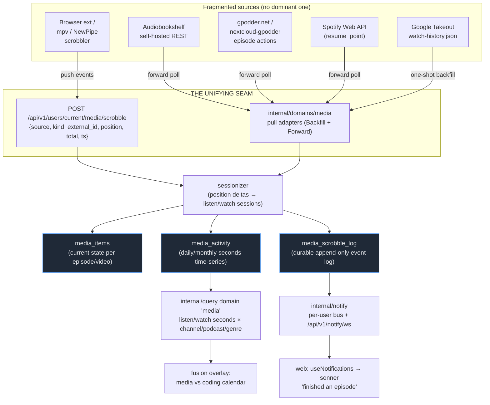
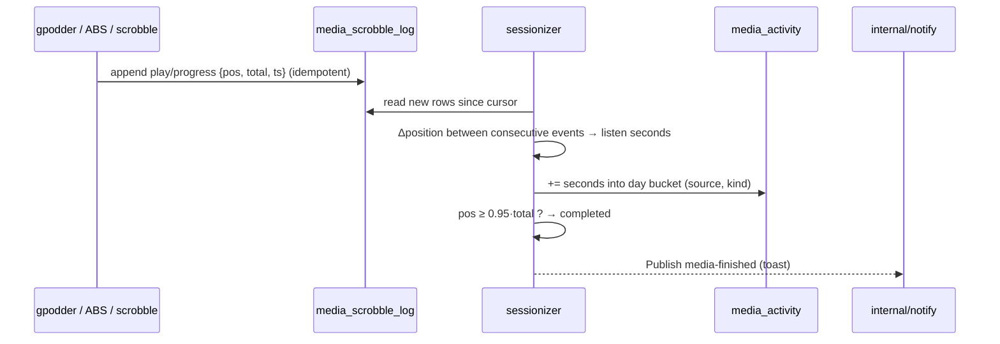

# catalyst-media Spike — Podcasts + YouTube Ingestion

> **Status:** investigation + design spike (2026-08). NOT an implementation
> order — it maps the design space and recommends a path. Beads follow.
> **Scope:** the `catalyst-media` domain — ingesting **podcast listening** and
> **YouTube watch** data into boomtime's existing
> domain / identity / heartbeat / event-stream model. The domain model
> (`media_items` / `media_activity`), the stable-identifier + linkage approach,
> the **event-stream / generic-scrobble** ingest seam, the query-DSL wiring, and
> a per-source viability matrix + phased plan.
> **Precedents this builds on and deliberately mirrors:**
> `docs/design/catalyst-books-sync-architecture.md` (the `reading_items` /
> `reading_activity` / `book_sync_state` template, the `internal/notify`
> subsystem, finished→event flow) and `docs/design/catalyst-domains-spike.md`
> (the `Module` seam + fusion strategy). **This doc is the podcasts+YouTube
> analog of the books doc.**

**Reading conventions.** Everything in `code font` (`reading_items`,
`internal/notify`, `AudibleSyncKind`, …) is a **real symbol on the current tree**
— cited with file/line where it grounds a claim. Web-sourced API facts (gpodder
endpoints, Audiobookshelf paths, Spotify scopes) carry a bracketed source ref
resolved in **§9 Sources**; verify exact shapes at implement time, but the
endpoint names are correct as of writing.

**The one-line thesis.** Podcasts have **no dominant source** the way Audible is
for audiobooks — the ecosystem is fragmented across a dozen half-open apps.
YouTube's watch history is **API-inaccessible by design** (deprecated since
~2016). Both realities point at the *same* answer: don't build N bespoke
pull-syncs. Build **one generic scrobble-ingest seam** (`POST …/media/scrobble`)
that any bridge/extension/sync-server posts position events to, plus **one strong
pull source per medium** for backfill (Audiobookshelf for podcasts, Google
Takeout for YouTube). The generic seam is the unifying architecture the
fragmentation forces on us.

**Non-negotiable rules** (inherited verbatim from the books doc's push-safety
constraints — they constrain every section):

- **Additive migrations only.** New tables (`media_items`, `media_activity`,
  `media_sync_state`, `media_scrobble_log`); never alter/drop an existing one.
- **Everything new is gated** behind a `cfg.MediaEnabled()` flag
  (`BOOM_FEATURE_MEDIA`). `main` ships with the flag off and stays deployable —
  same posture as `BOOM_FEATURE_BOOKS`.
- **Must BUILD:** `CGO_ENABLED=0 go build ./...` clean; FE `yarn typecheck` clean.
- **Siloed:** media data lives only in the new `media_*` tables; it never writes
  into `heartbeats` / `stats` / any core model. The fusion layer READS it via the
  query DSL; it never writes into core. (Exactly the `reading_items` contract —
  `internal/db/migrations/00058_reading_items.sql` header.)

---

## 0. The shape at a glance



Every box is either a real symbol today (`internal/notify`, `internal/query`,
`/api/v1/notify/ws`) or specified concretely below. The **left column is
plural and messy on purpose** — that fragmentation is the design driver.

---

## 1. The `catalyst-media` domain model

This mirrors catalyst-books one-for-one. Books proved the template; media reuses
the exact three-table shape (`reading_items` / `reading_activity` /
`book_sync_state`) with a fourth append-only log added for the event-stream angle
(§2). The `internal/domains/registry.go` seam already anticipates this —
its package doc names **"future catalyst-health / catalyst-media"** explicitly
(`internal/domains/registry.go:2-3`).

### 1.1 Stable identifiers — the hard part, per medium

The books domain keyed on ASIN (`external_id`, `UNIQUE (owner, source,
external_id)` — `00058_reading_items.sql`). Media has **two identifier
namespaces**, both externally stable and both needing a parent grouping:

| medium | item id (`external_id`) | parent grouping (`container_id`) | notes |
|---|---|---|---|
| **podcast** | episode **GUID** (`<guid>` from the RSS `<item>`) | **feed URL** (the podcast) | GUID is the podcast-namespace stable id; gpodder actions key on `episode` = media URL + `podcast` = feed URL [G]. Episode GUID is more stable than the media URL (CDNs rotate). Store both; prefer GUID. |
| **youtube** | **video id** (11-char) | **channel id** (`UC…`) | Both are permanent. Takeout gives the video URL (→ id) and channel URL (→ id) [T]. |

So the `external_id` semantics generalize cleanly: **`(owner, source,
external_id)` stays the unique item key**; a new `container_id` +
`container_name` pair holds the podcast/channel so the query DSL can group by it.
Podcast feed URL is the podcast-equivalent of "series"; YouTube channel is the
equivalent of "author".

**Namespacing sources.** `source` values: `abs` (Audiobookshelf), `gpodder`,
`spotify`, `takeout`, `scrobble` (the generic push endpoint carries its own
finer `source` string in the body). This mirrors books' `'audible' | 'kindle'`.

### 1.2 `media_items` — current-state per episode/video (NEW migration)

The one-row-per-thing table, analogous to `reading_items`. `raw_meta jsonb`
carries the full source payload so new attributes need no migration (same trick
as `00058`).

```sql
-- 000NN_media_items.sql (additive; NEW table)
CREATE TABLE IF NOT EXISTS public.media_items (
    id             bigserial   PRIMARY KEY,
    owner          text        NOT NULL REFERENCES public.users(username) ON DELETE CASCADE,
    source         text        NOT NULL,          -- 'abs'|'gpodder'|'spotify'|'takeout'|'scrobble'
    kind           text        NOT NULL,          -- 'podcast_episode' | 'youtube_video'
    external_id    text        NOT NULL,          -- episode GUID | youtube video id
    container_id   text        NOT NULL DEFAULT '',-- feed URL | channel id
    container_name text        NOT NULL DEFAULT '',-- podcast title | channel name
    title          text        NOT NULL DEFAULT '',
    duration_sec   integer,                        -- total episode/video length
    position_sec   integer     NOT NULL DEFAULT 0, -- last known playback position
    completed      boolean     NOT NULL DEFAULT false,
    started_at     timestamptz,
    finished_at    timestamptz,                    -- date col for count/complete measures
    last_played_at timestamptz,
    raw_meta       jsonb,
    synced_at      timestamptz NOT NULL DEFAULT now(),
    UNIQUE (owner, source, external_id)
);
CREATE INDEX IF NOT EXISTS media_items_owner_idx     ON public.media_items (owner);
CREATE INDEX IF NOT EXISTS media_items_container_idx ON public.media_items (owner, container_id);
```

Upsert is `COALESCE`-preserving on `started_at` / `finished_at` exactly like
`reading_items` (books doc §1.1), so a later low-info scrobble never clobbers a
known finish time.

### 1.3 `media_activity` — daily/monthly seconds time-series (NEW migration)

Byte-for-byte the `reading_activity` pattern (`00061_reading_activity.sql`) —
the grain the **fusion layer overlays on the coding calendar**. Different grain
than `media_items`, so it gets its own table (same reasoning the books doc gives
for splitting `reading_activity` off `reading_items`).

```sql
-- 000NN_media_activity.sql (additive; NEW table)
CREATE TABLE IF NOT EXISTS public.media_activity (
    id             bigserial   PRIMARY KEY,
    owner          text        NOT NULL REFERENCES public.users(username) ON DELETE CASCADE,
    source         text        NOT NULL,
    kind           text        NOT NULL,          -- 'podcast_episode' | 'youtube_video'
    granularity    text        NOT NULL DEFAULT 'day',   -- 'day' | 'month'
    bucket_date    date        NOT NULL,
    seconds        bigint      NOT NULL DEFAULT 0, -- listen (podcast) / watch (youtube) seconds
    plays          integer     NOT NULL DEFAULT 0, -- completions/starts in the bucket
    UNIQUE (owner, source, kind, bucket_date, granularity)
);
CREATE INDEX IF NOT EXISTS media_activity_owner_idx ON public.media_activity (owner);
```

`granularity` in the UNIQUE key lets **backfill write monthly buckets** (Takeout
gives timestamps but no durations — §3) while **forward scrobbles write daily
buckets** — the exact backfill-writes-months / forward-writes-days coexistence
the `reading_activity` header calls out.

### 1.4 `media_sync_state` — per-user/per-source cursors (NEW migration)

The `book_sync_state` analog (`00062`). Keeps delta bookkeeping out of the data
tables.

```sql
-- 000NN_media_sync_state.sql (additive; NEW table)
CREATE TABLE IF NOT EXISTS public.media_sync_state (
    owner              text NOT NULL REFERENCES public.users(username) ON DELETE CASCADE,
    source             text NOT NULL,
    last_action_cursor timestamptz,   -- gpodder `since` / ABS session cursor / Spotify played-after
    last_backfill_at   timestamptz,   -- NULL until the one-shot Takeout/library backfill completes
    last_forward_at    timestamptz,
    updated_at         timestamptz NOT NULL DEFAULT now(),
    PRIMARY KEY (owner, source)
);
```

The gpodder `since` timestamp (its response returns a new `timestamp` the client
must persist and resend [G]) and the Audiobookshelf session cursor both land in
`last_action_cursor` — the same cursor slot Audible's `purchased_after` uses in
books.

### 1.5 Linkage / secrets — the `00063` + registry analog

Per-source auth secrets (Audiobookshelf token, gpodder password, Spotify OAuth
refresh token) are **per-user encrypted columns** on `users`, and they must be
registered in `internal/domains/registry.go` or they get **stranded on the next
key rotation and dropped from backups** — the exact incident class that file's
header warns about (`registry.go:6-11`). Following the `amazon` / `hardcover`
precedent (`registry.go:47-64`), catalyst-media adds:

```go
// internal/domains/registry.go — additive entries
{Domain: "media", Table: "users", Column: "encrypted_abs_token",      KeyColumn: "username"},
{Domain: "media", Table: "users", Column: "encrypted_gpodder_secret", KeyColumn: "username"},
{Domain: "media", Table: "users", Column: "encrypted_spotify_refresh", KeyColumn: "username"},
// + matching BackupColumns entries (status + checked_at siblings)
```

This is the single most important **"don't forget"** — it is one list edit and
it is the difference between a domain whose secrets survive rotation/backup and
one that silently loses them (`registry.go:8-11`).

---

## 2. The event-stream angle — the core of this spike

DJ's framing: watch/listen events should be **"dumped to an event stream"** so
scrobbles flow as events (toast "finished an episode", feed the activity series).
boomtime already has the substrate. Two pieces exist, one is proposed.

### 2.1 What exists: `internal/notify` (transient per-user bus)

`internal/notify/hub.go` is a **domain-agnostic per-user event bus** — a caller
hands it a self-describing `Event{Type, Owner, Title, Body, Data, At}` and every
WS subscriber watching that owner receives it (`hub.go:22-67`). It is wired at
`/api/v1/notify/ws` via `h.SetNotify(notifyHub)` (`cmd/boomtime/main.go:300-301`)
and the audiobooks service already publishes finishes through it
(`audioSvc.SetNotify(notifyHub)` — `main.go:451`). The FE `useNotifications` hook
→ sonner toast is already built for books (books doc §5.3).

**This is exactly the toast side of what DJ wants — reuse it verbatim.** A
finished podcast episode publishes:

```go
notifyHub.Publish(notify.Event{
    Type:  "media-finished",
    Owner: owner,
    Title: "Finished an episode",
    Body:  containerName + " — " + title,
    Data:  map[string]any{"kind": "podcast_episode", "external_id": guid},
})
```

**Caveat (grounded):** `notify.Hub` is **lossy and transient by design** —
`Publish` is non-blocking and *drops* events for slow/absent subscribers
(`hub.go:52-66`), and it's **in-process only** (`hub.go` package doc: a cross-pod
Redis relay is the noted follow-up). So it is a **notification** channel, not a
durable event log. That's fine for toasts; it is NOT sufficient as the substrate
that "feeds the activity series." Hence 2.2.

### 2.2 What's proposed: `media_scrobble_log` (durable append-only event log)

The activity series and any replay/debug need a **durable** record. Add a fourth,
append-only table — the event log that both the sessionizer and (later) any
external consumer read:

```sql
-- 000NN_media_scrobble_log.sql (additive; NEW table)
CREATE TABLE IF NOT EXISTS public.media_scrobble_log (
    id           bigserial   PRIMARY KEY,
    owner        text        NOT NULL REFERENCES public.users(username) ON DELETE CASCADE,
    source       text        NOT NULL,        -- who posted it
    kind         text        NOT NULL,        -- 'podcast_episode' | 'youtube_video'
    external_id  text        NOT NULL,
    container_id text        NOT NULL DEFAULT '',
    event        text        NOT NULL,        -- 'play' | 'progress' | 'complete' | 'watch'
    position_sec integer,                     -- current playback position
    total_sec    integer,                     -- episode/video length
    event_ts     timestamptz NOT NULL,        -- source-supplied event time
    ingested_at  timestamptz NOT NULL DEFAULT now(),
    dedup_key    text        NOT NULL,        -- source|external_id|event_ts, idempotency
    raw          jsonb,
    UNIQUE (owner, dedup_key)
);
CREATE INDEX IF NOT EXISTS media_scrobble_log_owner_ts_idx
    ON public.media_scrobble_log (owner, event_ts);
```

Flow: **every** ingest path (pull adapter OR push endpoint) writes here first
(idempotent on `dedup_key`), then a sessionizer folds the log into `media_items`
+ `media_activity` (§4), and finished-detection publishes through
`internal/notify` (§2.1). The log is the source of truth; `notify` is the
fan-out. This is the same **"finished diff → event"** arrow the books doc draws,
made durable.

> **Design call for DJ:** do we want a *general* boomtime event log, or a
> media-scoped one? A media-scoped table ships now with zero blast radius; a
> generalized `event_log` (owner, domain, type, payload, ts) is the more ambitious
> "dump everything to an event stream" reading and could later back
> `internal/notify` itself. Recommendation: **ship media-scoped**, extract the
> general table only when a second domain wants it (the same
> jobsevents→notify generalization path — `notify/hub.go:1-4`).

### 2.3 The generic scrobble-ingest endpoint — the unifying seam

Given the fragmentation (§3), the highest-leverage single artifact is **one HTTP
endpoint any source can POST to**. It mirrors the existing heartbeat ingest
(`POST /api/v1/users/current/heartbeats` + `/heartbeats.bulk` —
`internal/server/server.go:120-122`, `ratelimit_test.go:71`). A browser
extension, an mpv Lua hook, a NewPipe fork, or a gpodder-sync bridge all speak
the same tiny contract:

```
POST /api/v1/users/current/media/scrobble        (single)
POST /api/v1/users/current/media/scrobble.bulk    (batch — mirrors heartbeats.bulk)
Authorization: Bearer <boomtime API token>        (same auth as heartbeat ingest)

{
  "source":      "browser-ext",          // free-form; namespaces the log row
  "kind":        "youtube_video",         // or "podcast_episode"
  "external_id": "dQw4w9WgXcQ",           // video id | episode GUID
  "container_id":"UC38IQsAvIsxxjztdMZQtwHA",
  "title":       "…",
  "event":       "progress",              // play | progress | complete | watch
  "position":    734,                     // seconds
  "total":       912,                     // seconds
  "ts":          "2026-08-12T15:04:05Z"
}
```

Handler = validate → insert into `media_scrobble_log` (idempotent) → enqueue a
sessionize job (§4) OR fold inline. This one endpoint **collapses the entire
messy left column of the §0 diagram into a single ingest contract** — the gpodder
bridge, the extension, and mpv all become thin translators to this shape. It is
the podcasts+YouTube answer to "there is no dominant source": we define the
source-of-record shape ourselves and let adapters feed it.

**Note on shape parity with gpodder.** The `{started, position, total,
timestamp}` play-action fields [G] map 1:1 onto `{_, position, total, ts}` here,
deliberately — a gpodder→boomtime bridge is a field rename, not a translation.

---

## 3. Per-source recommendation matrix

Legend — **Effort**: build cost of the adapter. **Richness**: how much of
{episode/video identity, position, duration, completion, timestamps} it yields.
**Model**: self-hosted vs third-party API. Sources cited to §9.

### 3.1 Podcasts (no dominant source — evaluate + recommend)

| source | model | auth | data richness | effort | verdict |
|---|---|---|---|---|---|
| **Audiobookshelf** [A] | self-hosted REST | Bearer API token | **Highest** — real playback *sessions* (`currentTime`, `timeListening`, `duration`, `startTime`) via `GET /api/sessions`; media progress via `GET/POST /api/me/progress/<id>`; podcast episodes first-class | Med | ★ **RECOMMENDED (pull).** True listen-*duration* sessions, not just positions. Clean `GET /api/sessions` backfill + forward. Self-hosted = no rate limits, full history, DJ controls it. |
| **gpodder.net API** [G] | open protocol (hosted **or** self-hosted via `nextcloud-gpodder`/`gopodder`) | HTTP Basic | **High** — episode actions `play` with `{started, position, total, timestamp}`; `since`-cursor incremental sync | Med | ★ **RECOMMENDED (protocol/bridge).** This *is* podcast scrobbling. AntennaPod/other apps already push here. A boomtime "device" that pulls `GET /api/2/episodes/{user}.json?since=` = instant multi-app coverage. |
| **AntennaPod** [G] | Android app; local DB + gpodder sync | via gpodder | High (through gpodder) | Low (if via gpodder) | Covered transitively by the gpodder bridge — no separate adapter. Point AntennaPod at your gpodder/nextcloud server; boomtime reads it. |
| **Spotify Web API** [S] | third-party API | OAuth (`user-read-playback-position`) | **Medium** — episode `resume_point{resume_position_ms, fully_played}` + "recently played episodes"; **no full historical export**, position only when you fetch an episode | Med-High | Secondary. Only source for Spotify-exclusive shows, but OAuth dance + no bulk history + position-not-duration make it a forward-only nicety. |
| **Pocket Casts** [P] | **unofficial** API (`api.pocketcasts.com`) | login token | Medium-High — history endpoint, in-progress, starred | Med (fragile) | Contingency. Unofficial/undocumented → can break anytime. Only if DJ lives in Pocket Casts. Prefer routing it through the generic scrobble endpoint via a small scraper. |
| **Overcast** | OPML + limited web export | account | Low — subscriptions + limited played flags, no positions | Low | Backfill-of-subscriptions only; not a progress source. |
| **Apple Podcasts** | none (no public API) | — | None programmatic | — | Not viable. Skip. |
| **ListenBrainz** [L] | scrobble submission API | user token | Music-shaped (`artist_name`/`track_name` required); **no first-class podcast/episode model** | Low | Not an ingest *source* for us. Possible *downstream* mirror (submit episodes as listens), but lossy for podcast semantics. De-prioritize. |

**Podcast recommendation:** ship **Audiobookshelf pull first** (richest, fully
self-hosted, real durations), and **stand up the gpodder bridge second** to
sweep in every AntennaPod/other-app listen through one protocol. Everything else
(Spotify, Pocket Casts) becomes an optional **adapter that POSTs to the generic
scrobble endpoint** (§2.3) rather than a bespoke pull-sync.

### 3.2 YouTube (watch history is API-inaccessible by design)

| source | model | auth | data richness | effort | verdict |
|---|---|---|---|---|---|
| **YouTube Data API v3** [Y] | Google API | OAuth | **Watch history NOT available** — `watchHistory` playlist is an empty placeholder since ~2016; `activities` deprecated. Only liked/playlists/subscriptions | — | ✗ Cannot supply watch history. Useful only to *enrich* a video id (title/channel/duration) after the fact. |
| **Google Takeout** `watch-history.json` [T] | one-shot export | account (manual download) | **Medium** — full historical list of `{video URL, title, channel URL, watched timestamp}`; **NO watch duration and NO video duration** | Low (parser) | ★ **RECOMMENDED (backfill).** The only real history source. One-shot import → `media_scrobble_log` as `event=watch` rows. Backfill writes *monthly `media_activity` buckets* since durations are absent (count-of-watches, not seconds). |
| **Browser extension** [X] | self-hosted / client | posts to our token | **High (forward)** — can emit real position/duration progress events from the watch page | Med | ★ **RECOMMENDED (forward).** Thin extension → `POST …/media/scrobble` with `{video id, channel id, position, total, ts}`. Web-Scrobbler/multi-scrobbler are prior art for the pattern. |
| **FreeTube / Invidious history** [N] | self-hosted YT frontend | local | High if used exclusively — local history DB | Med | Strong alternative to the extension **iff** DJ watches via these. Export/hook their history → scrobble endpoint. |
| **NewPipe / mpv scrobbler** [N] | client hook | posts to our token | High (forward) | Med | Same pattern — a client-side hook that POSTs progress. Good for mobile (NewPipe) / desktop (mpv Lua). |

**YouTube recommendation:** **Takeout for the one-time backfill** (accept
count-only, no seconds) + **a lightweight browser extension (or FreeTube hook)
that POSTs to the generic scrobble endpoint for forward** watch data with real
positions. Stable id = video id + channel id [T][Y].

---

## 4. The reading/media heartbeat translation

Both media map onto the **same `reading_activity`-shaped time-series** the fusion
overlay already consumes — the translation is per-medium but the output shape is
identical.

### 4.1 Podcasts: position deltas → listen sessions (Kindle-LPR analog)

The books doc treats Audible/Kindle progress as **position polled over time**;
the delta between polls, attributed to the wall-clock between them, is listening
time. Podcasts are the cleanest case:

- **gpodder `play` actions** already carry `{started, position, total,
  timestamp}` [G]. Consecutive actions on the same episode → `Δposition` listened
  in the interval. Sum Δpositions per day → `media_activity.seconds`.
- **Audiobookshelf** is even better — it hands you `timeListening` and
  `currentTime` per *session* directly [A]; no delta math, just bucket
  `timeListening` by `startTime`'s date.
- **Completion**: `position ≥ ~0.95 × total` (or ABS `fully_played`/progress=1,
  or Spotify `fully_played` [S]) → set `media_items.completed`, stamp
  `finished_at`, publish `media-finished` via `internal/notify` (§2.1).



### 4.2 YouTube: watch events → watch heartbeats

- **Forward (extension/FreeTube):** the player emits progress events (position
  every N seconds, or on pause/ended). Identical Δposition→seconds folding as
  podcasts → `media_activity.seconds` with `kind='youtube_video'`. This is a true
  **watch heartbeat**, the closest analog to boomtime's own coding heartbeats.
- **Backfill (Takeout):** only `{watched timestamp}` — **no duration** [T]. So
  backfill writes **`plays += 1` into a monthly bucket**, `seconds` left 0 (or
  estimated only if the Data API is later called to fetch video duration [Y]).
  This is the same **backfill-writes-months, forward-writes-days** split
  `reading_activity` bakes into its UNIQUE key — here reinforced by a genuine data
  gap, not just a cadence choice.

**Net:** one sessionizer, two folding rules keyed on `kind`; one output table
shape (`media_activity`) the fusion overlay already knows how to read.

---

## 5. Query-DSL wiring (`internal/query`)

Adding catalyst-media to the analytics engine is **one `Register` call in
`internal/query/domains.go`** — the compiler, grammar, and safety model are
domain-agnostic (`domains.go:2-4`; `registry.go:1-15`). It mirrors
`registerReading` (`domains.go:54-104`) exactly: measures bound to one table,
dimensions whitelisted per-measure (v1 forbids cross-table joins —
`registry.go:9-14`).

```go
// internal/query/domains.go — registerMedia()  (sketch)
const (
    mact  = "media_activity"
    mitem = "media_items"
)
dims := map[string]Dimension{
    "source":    {Name: "source",    Table: mact,  Expr: "source"},
    "kind":      {Name: "kind",      Table: mact,  Expr: "kind"},         // podcast vs youtube
    "container": {Name: "container", Table: mitem, Expr: "container_name"},// podcast title | channel
    "title":     {Name: "title",     Table: mitem, Expr: "title"},
}
Register(Domain{
    Name: "media",
    Measures: map[string]Measure{
        // real listen/watch time — no per-item attribution on the activity table,
        // so it groups only by source/kind/date (same shape as reading "seconds").
        "seconds": {Name: "seconds", Table: mact, Expr: "sum(seconds)",
            DateCol: "bucket_date", OwnerCol: "owner", Dims: []string{"source", "kind"}},
        // completions carry the item dimensions (channel/podcast/title).
        "plays":   {Name: "plays", Table: mitem, Expr: "count(*)",
            DateCol: "finished_at", OwnerCol: "owner",
            Dims: []string{"source", "kind", "container", "title"}},
    },
    Dimensions: dims,
})
```

This gives dashboards/goals queries like *"watch seconds by channel, last 30
days"* or *"podcasts finished this week"* for free through the existing DSL —
and adds the media series to the **fusion overlay against the coding calendar**
(`domains.go:2` names media as an intended domain). Table/owner-col map to append
to the `domains.go` header comment: `media_activity owner=owner date=bucket_date`;
`media_items owner=owner date=finished_at`.

---

## 6. Job wiring, cadence, gates (`internal/jobs`)

Pull adapters run as **catalyst-go-jobs kinds**, exactly like
`AudibleSyncKind = "audiobooks-audible-sync"` /`AudibleBackfillKind`
(`internal/domains/audiobooks/audiobooks.go:40-47`) and
`KindleSyncKind = "books-kindle-sync"` (`books.go:25-26`). Proposed kinds:

```go
// internal/domains/media/media.go
const (
    ABSForwardKind      = "media-abs-forward"       // poll ABS /api/sessions
    GpodderForwardKind  = "media-gpodder-forward"   // pull gpodder episode actions since cursor
    TakeoutBackfillKind = "media-takeout-backfill"  // one-shot Takeout import
    SpotifyForwardKind  = "media-spotify-forward"   // optional
    SessionizeKind      = "media-sessionize"        // fold scrobble_log → items+activity
)
```

**Concurrency limiter (`internal/jobs/limiter.go`).** `media-sessionize` is the
one to watch — the generic scrobble endpoint (§2.3) can burst events, and
sessionize touches `media_items`/`media_activity` per owner. Cap it via the
existing per-kind `KindLimiter` (`limiter.go:12-33`) — e.g. `media-sessionize:
1` per owner-ish granularity so bursts stay durably `status=queued` in Postgres
and drain as slots free (`limiter.go:12-17`), rather than thundering. External
poll kinds (`media-gpodder-forward`, `media-abs-forward`) get modest caps to be
polite to third-party/self-hosted servers. The limiter is fleet-wide when a
Dragonfly/Redis client is present, in-process otherwise (`limiter.go:41-49`) —
no new infra needed for local dev.

**Gate.** All kinds + the scrobble endpoint gate behind `cfg.MediaEnabled()`
(`BOOM_FEATURE_MEDIA`), mirroring `BOOM_FEATURE_BOOKS`. `main` ships flag-off.

---

## 7. Where this touches identity + backups

- **Identity:** all `media_*` tables are `owner text REFERENCES users(username)
  ON DELETE CASCADE` — the same siloed, per-user-wipeable contract as
  `reading_items` (`00058` header; books doc §1.3). A user deleting their account
  cascades their media rows; a per-source delete path (like
  `internal/db/reading_items.go`'s) lets them wipe just YouTube or just podcasts.
- **Secrets + backups:** §1.5 — register every encrypted secret column in
  `internal/domains/registry.go` so rotation + whole-DB backup pick them up
  automatically (`registry.go:41-65`). The scrobble endpoint's Bearer token is a
  boomtime API token (no new secret); only the *pull* sources (ABS/gpodder/Spotify
  creds) introduce encrypted columns.

---

## 8. Open questions + phased plan

### 8.1 Open questions for DJ

1. **General event log vs media-scoped?** (§2.2) — recommend media-scoped now,
   generalize on second consumer.
2. **Which source first?** Recommendation below picks **Audiobookshelf** (you
   self-host it, richest data, zero rate limits). Confirm you run ABS with
   podcasts, or whether gpodder/AntennaPod is your actual daily driver.
3. **YouTube forward mechanism:** browser extension vs FreeTube/Invidious hook
   vs NewPipe fork — which matches how you actually watch? Determines the first
   scrobble adapter.
4. **Watch-seconds for YouTube backfill:** accept count-only from Takeout, or
   spend Data API quota to fetch each video's *duration* and estimate? Recommend
   count-only v1 (durations ≠ watch time anyway).
5. **Position privacy:** scrobbles reveal exactly what you watch/listen to. The
   `public_profile` surface must default media OFF (parity with how books data is
   treated).

### 8.2 Phased, bead-able plan (each phase independently shippable, `main` deployable)

| phase | deliverable | why first |
|---|---|---|
| **P0** | `media_items` + `media_activity` + `media_sync_state` + `media_scrobble_log` migrations; `cfg.MediaEnabled()` gate; registry.go secret entries | Schema + gate, zero behavior. Unblocks everything. |
| **P1** | **Generic scrobble endpoint** `POST …/media/scrobble(.bulk)` → `media_scrobble_log`; the sessionizer job (`media-sessionize`) folding log → items+activity; finished→`internal/notify` toast | The unifying seam. Immediately testable with `curl`. Every later source is now a thin adapter. |
| **P2** | **Audiobookshelf pull** (`media-abs-forward` + backfill) — richest podcast source, self-hosted | Proves the pull path end-to-end with real sessions/durations. |
| **P3** | **YouTube Takeout backfill** (`media-takeout-backfill`) + **`registerMedia` query domain** + fusion overlay | Lights up the analytics/calendar overlay with real history. |
| **P4** | **gpodder bridge** (`media-gpodder-forward`) — sweeps AntennaPod/other apps via one protocol | Broadest podcast coverage for low marginal effort. |
| **P5** | **YouTube forward scrobbler** (browser ext / FreeTube hook → scrobble endpoint) | Forward watch heartbeats with real positions. |
| **P6 (opt)** | Spotify / Pocket Casts adapters → scrobble endpoint; generalized `event_log` if a 2nd domain wants it | Long-tail sources, all riding the P1 seam. |

**Top recommendation, restated:**
- **Podcasts →** Audiobookshelf self-hosted REST pull (`GET /api/sessions`,
  `/api/me/progress`) as the primary, a **gpodder-sync bridge** as the
  multi-app sweep, both optionally normalized through the generic scrobble
  endpoint.
- **YouTube →** **Google Takeout `watch-history.json`** for one-shot backfill
  (count-only) + a **lightweight browser/FreeTube scrobbler → the generic
  scrobble endpoint** for forward watch data. Stable id = video id + channel id.
- **The keystone →** the **`POST …/media/scrobble` event seam + `media_scrobble_log`**
  is the single artifact that makes the fragmented source list tractable; build
  it in P1 before any specific integration.

---

## 9. Sources

- **[G] gpodder.net Episode Actions API** — endpoints `POST/GET /api/2/episodes/{username}.json`,
  play-action fields `{podcast, episode, action, started, position, total, timestamp}`,
  HTTP Basic auth, `since` incremental cursor:
  https://gpoddernet.readthedocs.io/en/latest/api/reference/events.html ,
  https://gpoddernet.readthedocs.io/en/latest/api/integration.html .
  Self-hostable implementations: nextcloud-gpodder (https://github.com/thrillfall/nextcloud-gpodder),
  gopodder (https://github.com/cbrgm/gopodder).
- **[A] Audiobookshelf API** — `POST /api/items/<id>/play` & `/api/podcasts/<id>/play`,
  `GET /api/sessions`, `POST /api/sessions/<id>/sync|close`, `GET/POST /api/me/progress/<id>`,
  Bearer token; session fields `currentTime, timeListening, duration, startTime, episodeId`:
  https://api.audiobookshelf.org/ ,
  https://deepwiki.com/audiobookshelf/audiobookshelf-api-docs/3.6-playback-and-progress-tracking .
- **[S] Spotify Web API podcasts** — `resume_point{resume_position_ms, fully_played}`,
  scope `user-read-playback-position`, `GET /v1/episodes/{id}`, recently-played-episodes:
  https://developer.spotify.com/documentation/web-api/reference/get-a-shows-episodes ,
  https://developer.spotify.com/blog/2020-03-20-introducing-podcasts-api .
- **[P] Pocket Casts unofficial API** (`api.pocketcasts.com`, login token, history endpoint):
  https://www.mikestreety.co.uk/blog/get-your-pocket-casts-data-using-the-unofficial-api-and-php/ ,
  https://pypi.org/project/pocketcasts-api/ .
- **[L] ListenBrainz submit-listens** — `POST /1/submit-listens`, `listen_type` +
  `track_metadata.{artist_name,track_name}` required (music-shaped, no first-class podcast model):
  https://listenbrainz.readthedocs.io/en/latest/users/json.html ,
  https://listenbrainz.readthedocs.io/en/latest/users/api-compat.html .
- **[Y] YouTube Data API v3** — watch history unavailable (`watchHistory` empty placeholder since ~2016,
  `activities` deprecated): https://bhanueso.dev/blips/youtube-watch-history-extension ,
  https://developers.google.com/resources/api-libraries/documentation/youtube/v3/java/latest/deprecated-list.html .
- **[T] Google Takeout `watch-history.json`** — full history `{video URL, title, channel URL, timestamp}`,
  no watch/video duration: https://positroid.tech/en/post/youtube-history-analyzer ,
  https://pypi.org/project/google-takeout-parser/ .
- **[X] Browser scrobbler prior art** — Web Scrobbler (Last.fm/Libre.fm/ListenBrainz),
  multi-scrobbler: https://webscrobbler.com/ , https://github.com/foxxmd/multi-scrobbler .
- **[N] Self-hosted YouTube frontends / clients** — NewPipe/NewPipeWeb, FreeTube/Invidious history,
  mpv scrobblers: https://github.com/chukjosh/NewPipeWeb , https://github.com/TeamNewPipe/NewPipe/issues/7496 .

**boomtime code cited:** `internal/domains/registry.go` (secret/backup registry;
names catalyst-media as intended), `internal/domains/audiobooks/audiobooks.go` &
`books/books.go` (job-kind pattern), `internal/db/migrations/00058_reading_items.sql`,
`00061_reading_activity.sql`, `00062_book_sync_state.sql`, `00063_hardcover_link.sql`
(the table template), `internal/query/domains.go` + `registry.go` (DSL wiring +
safety model), `internal/notify/hub.go` + `cmd/boomtime/main.go:300-301,451`
(event bus + WS wiring), `internal/jobsevents/hub.go` (its jobs-scoped precursor),
`internal/jobs/limiter.go` (per-kind concurrency cap),
`internal/server/server.go:120-122` (heartbeat ingest = the scrobble-endpoint precedent),
`docs/design/catalyst-books-sync-architecture.md` (the mirrored structure).
