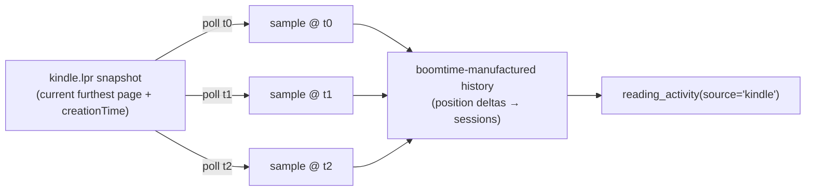
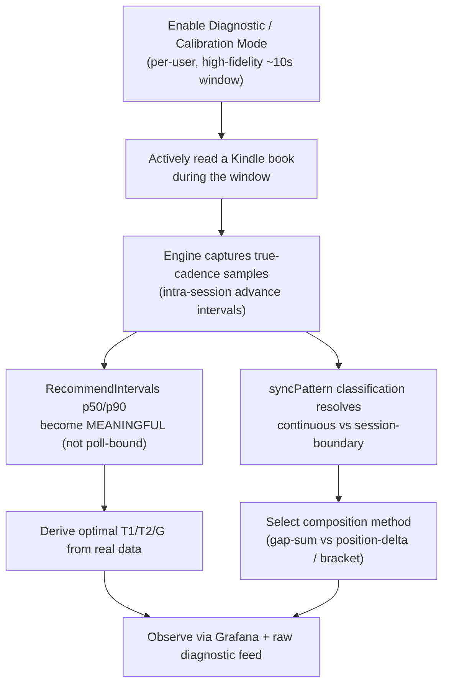

# Reading-Cadence Measurement — the epistemology & confirmation procedure

**Companion to** [`catalyst-books-domain-architecture.md`](./catalyst-books-domain-architecture.md).
That doc specifies the *mechanism* (§5 the reading-heartbeat model, §5.1 the
two-level poll + persistent monitor, §6.4 the settled reading-time findings).
This doc goes deeper on the *measurement problem* underneath it: what we can
know about a reader's cadence, why the naïve reading of our own dashboards is a
trap, and the exact procedure by which we confirm the model rather than assume
it. It is reasoning-dense on purpose — the implemented mechanics live in
`internal/domains/books/monitor.go` and `monitor_recommend.go`.

---

## 1. The core problem — poll, not push

Amazon exposes **no push, no webhook, no subscription** for reading progress.
The only forward-looking surface is the CDE **sidecar** (`kindle.lpr`), and it is
**per-book** (`sidecar?type=EBOK&key=<ASIN>`) and returns a **snapshot, not a
history**: one record — the *current furthest-page-read* `location` plus its
`creationTime` — with nothing behind it. There is no "give me the last N
positions" call; the previous value is simply gone the moment Amazon overwrites
it.

The single most important consequence:

> **boomtime BECOMES the history by polling.** There is no history to fetch — we
> manufacture one by sampling the snapshot over time and diffing. Every question
> in this doc flows from that inversion.

And it sets a hard **cost floor**. Because the sidecar is per-book and nothing is
pushed, the only way to learn *whether anyone is reading right now* is to poll
**every in-progress book, for every user** — one ADP-signed call to
`cde-ta-g7g.amazon.com` each. Detection is inherently `O(books × users × 1/interval)`.
That sweep is the floor we minimize; hammering it is exactly how we would get
throttled or noticed.

---

## 2. The fidelity / Nyquist problem (the crux)

The load-bearing insight of the whole investigation:

> **You cannot measure a cadence by sampling slower than it.**

Whispersync overwrites the furthest-page-read at its own true rate. Our poll
lands whenever *our* timer fires. When the poll interval is **coarser** than the
real push interval, every poll catches only the **latest** snapshot and silently
swallows all intermediate advances — an A→…→…→B run collapses into a single
observed A→B jump. The measured advance-interval then **aliases to the poll
rate**: the histogram clusters around *our own cadence*, not whispersync's.

This is Nyquist, applied to reading. At normal operational polling
(L2 = 60s capture / L1 = 120s detect) the observed cadence is **poll-rate-bound
by construction**. The dashboards will look populated and self-consistent and
still be measuring the wrong thing.

The trap this creates:

- The optimal-interval recommendation (`RecommendIntervals`) self-populates from
  ordinary operation — no special mode needed to get *numbers*.
- But those numbers describe the interval **between polls that happened to catch
  an advance**, floored at 60s (`fidelityFloorSecs`). They are **not** the true
  whispersync push cadence. Reading them as such would be circular: we'd be
  "discovering" the cadence we imposed.

Measuring **true** cadence therefore requires a deliberate **high-fidelity burst**
— poll *much faster* than the suspected true push interval (target ~10s, well
under any plausible page-turn-to-sync latency) — for a bounded window while a
book is actively read. That is the **calibration mode**, and it is the *only*
regime in which the recommendation's p50/p90 mean what they appear to mean.

| Regime | Poll interval | What the interval histogram measures |
|---|---|---|
| Normal operation (L1/L2) | 60–120s | aliased to poll rate — **poll-rate-bound**, not true cadence |
| Calibration burst | ~10s | true inter-advance cadence — **whispersync-bound** (if pushes are that frequent) |

---

## 3. The `creationTime` nuance — what it fixes and what it does NOT

The `kindle.lpr` record carries **Amazon's own event time** (`creationTime`) for
when the furthest-page-read was set — *not* our poll time. The engine anchors all
state and histograms on it (`monitor.go`, `eventTime := at`). This buys two real
things, and it is important to be precise about their boundary:

**What `creationTime` fixes:**

1. **Detection is never lost, however coarse the poll.** We always learn the
   current position *and when Amazon last advanced it*. So a larger `T1` costs
   only toast **latency**, not data — total-reading detection survives arbitrarily
   slow polling.
2. **Live advance vs. stale first-sight — no false toasts.** Enabling the monitor
   over a library of long-finished books must not fire a flurry of "Reading:"
   toasts. `creationTime` distinguishes a genuine live advance (fresh event time)
   from the first sight of a position set long ago (`freshEvent :=
   now.Sub(at) <= IdleGap` in `monitor.go`). Stale first-sights anchor state
   silently — no metric, no toast, no active flip.

**What `creationTime` does NOT fix:**

> A snapshot is still a snapshot. `creationTime` timestamps the *latest* advance;
> it recovers **nothing** about the advances between two polls. If three page-syncs
> happened between poll *t0* and poll *t1*, `creationTime` tells us only when the
> **third** one landed. The intra-advance **resolution** is gone.

So the clean division of labor is: **`creationTime` fixes detection and
attribution (when did the observed change truly happen, and is it real);
fine-grained polling is the only thing that recovers resolution (how many
advances, at what spacing).** Coarse-poll + `creationTime` gives you a correct
*total* and a correct *last-event time* with zero false positives — but a
poll-rate-bound *cadence*. §2 and §3 are two faces of the same limit.

---

## 4. The two-level poll as the cost-minimizing response

Given the §1 cost floor and the §2 fidelity limit, the architecture is the
minimal structure that reconciles them: **detect everything cheaply, capture only
the active thing finely.**

| Level | Scope | Interval | Purpose |
|---|---|---|---|
| **L1 — detect** | ALL in-progress books, per user | `T1` (coarse, default 120s) | spot which book advanced = being read now |
| **L2 — capture** | ONLY the active book(s) | `T2` (fine, default 60s) | sample cadence for session boundaries, until idle `G` (300s) → drop to L1 |

This collapses cost from "every book fast, always" to "every book slow + the 1–2
books *actually* being read fast, only while read." (`runMonitorPass` in
`monitor.go` implements exactly this state machine: idle-expiry flip → per-book
due check at the level interval → advance classification → compose.)

**The fidelity FLOOR — why we never fast-poll in normal operation.** Reading-time
is **minute-level analytics**. Sampling the active book finer than ~60s produces
nothing usable downstream and only burns ADP-signed Amazon calls, raising the
very throttle/notice risk the §1 floor warns about. So `CaptureInterval` defaults
to 60s and `RecommendIntervals` **floors** capture at `fidelityFloorSecs = 60`
regardless of the observed cadence. The binding lower bound on normal capture is
whichever is **coarser** — 60s or the true push cadence.

> **Calibration is the deliberate exception to the floor.** The ~10s burst of §2
> intentionally violates the 60s floor for a *bounded* window, accepting the extra
> Amazon load as the one-time price of measuring true cadence. It is not an
> operational mode; it is an instrument.

---

## 5. The sync-trigger hypothesis + classification

We do not yet *know* when whispersync pushes. The reasoned hypothesis:

> Whispersync's real job is cross-device position **handoff**, and the handoff
> moments are device **close** and **open**. So the furthest-page-read most likely
> updates at **session boundaries** (close, maybe open), **not** continuously as
> pages turn.

This unknown decides the entire composition math, because it determines whether
intra-session poll samples even *exist* to sum:

- **If session-boundary-only:** mid-session L2 capture sees *nothing* until the
  book is closed — so the temporal **gap-sum breaks** (no intra-session samples to
  sum). Reading-time must instead come from **position-delta × reading-speed**,
  anchored at the close `creationTime` (= when you stopped). *Best case:* if the
  **open** event fires its own `startReading`-type marker, then open
  `creationTime` = session **start** and close `creationTime` = session **end**,
  and we **bracket** the real session for a *true* duration with **no
  reading-speed guess at all**.
- **If continuous:** frequent small advances arrive mid-session and the original
  gap-sum session model (§5 of the architecture doc) works directly.

**The monitor classifies observed advances** into one of three patterns and states
which applies, so the composition method is never guessed:

| Pattern | Signature | Composition method |
|---|---|---|
| **`continuous`** | frequent advances (< ~2 min apart), **small** Δlocation | temporal **gap-sum** of poll samples |
| **`session-boundary`** | sparse advances, **large** Δlocation jumps | **position-delta × reading-speed**, or **open/close bracketing** if an open marker fires |
| **`unknown`** | too few advances observed yet | keep sampling; fall back to position-delta |

Two composition methods, one auto-switch: the engine **defaults to gap-sum** and
migrates a source to position-delta / bracketing once calibration data classifies
it as `session-boundary`. The `wasActive` gate in `monitor.go` already encodes the
distinction at sample-time — a session-START advance has no intra-session
predecessor, so its gap to the prior (stale) `last_advance_at` is a *cross-session
boundary*, excluded from the histogram, the reading-seconds counter, and the
recommendation window. Only genuine in-session gaps become cadence samples.

---

## 6. The confirmation procedure

How we actually move a claim from *hypothesis* to *confirmed*:

**Steps:**

1. Flip the per-user calibration (Diagnostic) mode on — a bounded high-fidelity
   window that deliberately polls the active book at ~10s (§4's exception to the
   floor), with **verbose** toast mode (a toast on *every* advance) so the raw
   push cadence is directly observable.
2. Actively read a Kindle book during the window.
3. The engine captures true-cadence samples into
   `kindle_reading_monitor_advances`. Now the recommendation's **p50/p90** and the
   **syncPattern** classification describe whispersync, not our poll timer.
4. `RecommendIntervals` yields optimal `T1`/`T2`/`G` from *your own* reading; the
   classification selects the composition method.

**Observability.** The report lives in **Grafana**, not a bespoke UI:

- Board **`Reading monitor (whispersync cadence)`** (uid `boomtime-reading-monitor`)
  — driven by `boomtime_reading_monitor_advances_total`,
  `boomtime_reading_monitor_advance_interval_seconds`,
  `boomtime_reading_monitor_active_books`,
  `boomtime_reading_monitor_sec_per_location`.
- The raw **per-source diagnostic feed** — Loki `reading monitor: advance` logs,
  one structured line per observed advance (owner, book, location, Δloc,
  `creation_time`, `interval_s`).

The admin panel is intentionally thin: the enable toggle, the mode flag, the
`T1`/`T2`/`G` recommendation, and a deep-link into that board.

### 6.1 Epistemic status ledger

State it plainly so the model's standing is never overclaimed:

| Claim | Status | Basis |
|---|---|---|
| Amazon polls, never pushes (no webhook) | **CONFIRMED** | §6.4 live probing |
| Sidecar is a snapshot, not a history | **CONFIRMED** | §6.4 — every device endpoint returns current position + one timestamp |
| `percentageRead` is always `0` via Cloud Reader | **CONFIRMED** | §6.4 — present in schema, unpopulated in practice |
| Per-session reading MINUTES unretrievable via any credential API | **CONFIRMED** | §6.4 — Insights ignores every minutes-shaped param; RMD CSV is the only real-minutes source, manual/async |
| Whispersync pushes at **session boundaries** (close/open) | **HYPOTHESIS** | §5 reasoning from handoff purpose; not yet observed |
| An **open** event fires a `startReading` marker (→ true bracketing) | **HYPOTHESIS** | best-case sub-branch of the above |
| Each source's `continuous` / `session-boundary` classification | **PENDING** | awaits a calibration run to resolve |
| Optimal `T1`/`T2`/`G` from *true* cadence | **PENDING** | recommendation is poll-rate-bound until a calibration run populates it |

Until a calibration run lands, the monitor still runs and still emits
`reading_activity(source='kindle')` via the shared composition — it defaults to
gap-sum and produces correct *totals* (detection is confirmed-robust); only the
*resolution* and the *method switch* are pending.

---

## 7. The Audible contrast — read backward, not forward

None of the above applies to Audible. Audible's `stats/aggregates` already returns
**listening-seconds per period**, pre-aggregated by Amazon and **retroactive** —
so reading-time is **read directly**, no polling, no snapshots, no inference, no
cadence to measure. The entire cadence-measurement apparatus is **Kindle-specific**,
a consequence purely of the sidecar being a forward-only snapshot.

| | Kindle (books) | Audible (audiobooks) |
|---|---|---|
| Native signal | per-book sidecar LPR snapshot (current position + `creationTime`) | `stats/aggregates` listening-seconds per period |
| Direction | **poll-forward** — boomtime manufactures the history | **read-backward** — Amazon already knows the answer |
| History | none exists; we sample & diff | retroactive, pre-aggregated |
| Cadence problem? | **yes** — Nyquist-bound (§2), needs calibration | **no** — totals are handed to us |
| Composition | gap-sum / position-delta / bracket, per classification | none — read totals as-is into buckets |

The fusion layer overlays both on one `reading_activity` calendar; only the Kindle
half required this investigation.

---

## Cross-references

- Mechanism & context: [`catalyst-books-domain-architecture.md`](./catalyst-books-domain-architecture.md)
  §5 (reading-heartbeat model), §5.1 (two-level poll + persistent monitor), §6.4
  (settled reading-time findings).
- Implementation: `internal/domains/books/monitor.go` (two-level state machine,
  advance classification, `creationTime` anchoring, toast modes),
  `internal/domains/books/monitor_recommend.go` (interval recommendation heuristic).
- Observability: Grafana board uid `boomtime-reading-monitor`.
